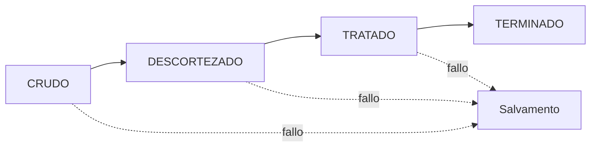
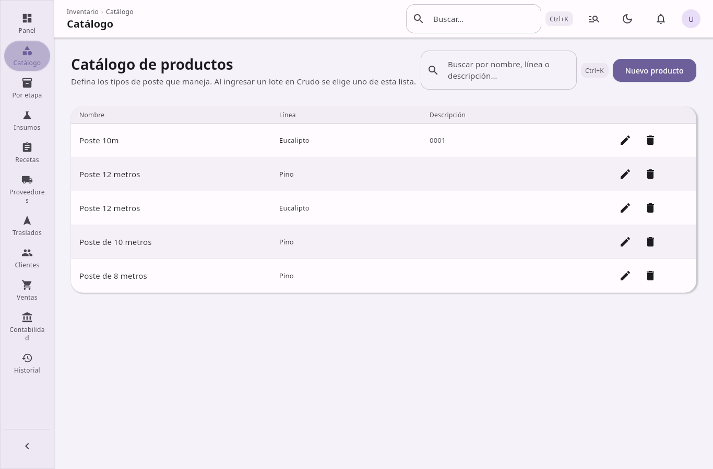
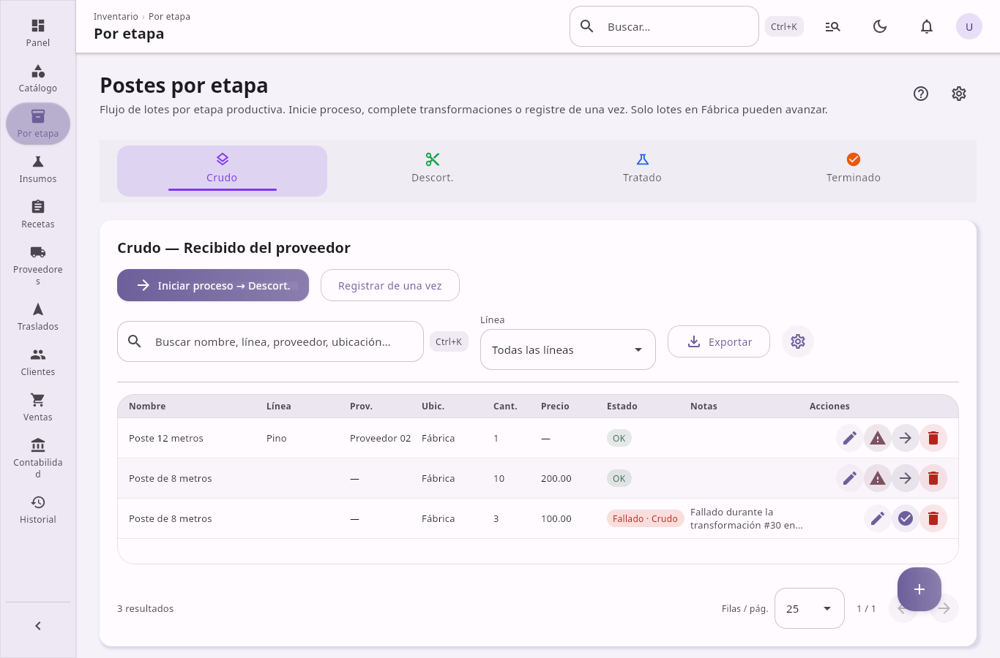
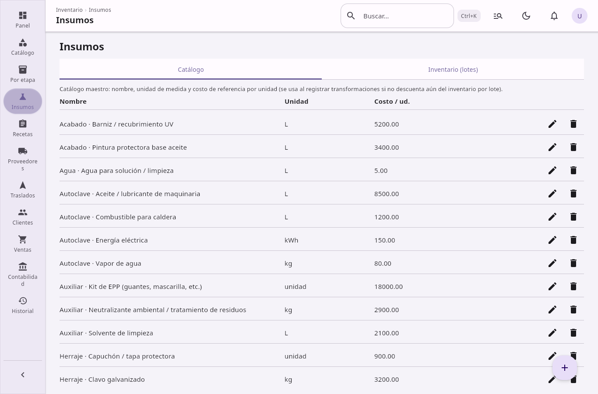
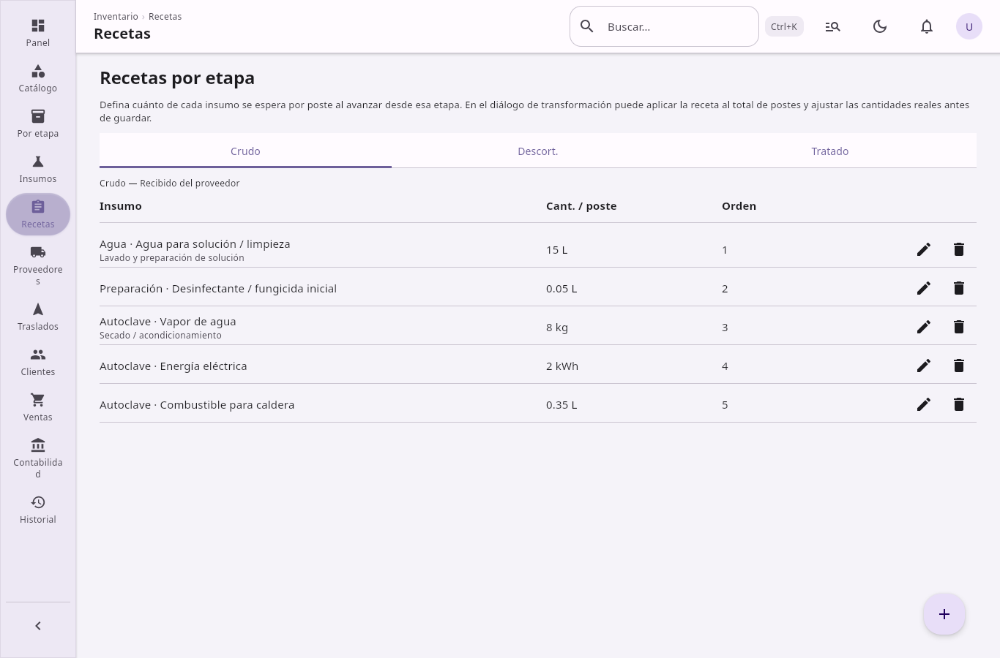

# Funcionalidades del sistema

## Inventario · Postes de luz de madera

**Inventory Industry** es una aplicación de escritorio para gestionar inventario, producción, costos y ventas de **postes de luz de madera** en un flujo industrial de varias etapas. El sistema registra lotes desde la adquisición en proveedor hasta la venta final, incluyendo transformaciones, insumos, traslados y contabilidad de costos.

| Aspecto | Detalle |
|---------|---------|
| Tipo | Aplicación de escritorio (un usuario, datos locales) |
| Plataforma | Windows, macOS y Linux (empaquetado nativo) |
| Base de datos | SQLite en `~/.inventory-industry/inventory.db` |
| Interfaz | Español, Material Design 3, Jetpack Compose Desktop |

---

## 1. Introducción

### 1.1 Propósito

El sistema cubre el ciclo operativo y financiero de una planta que procesa postes de madera:

- Registrar materia prima y proveedores
- Trasladar lotes desde el predio del proveedor hasta la fábrica
- Avanzar lotes por etapas de producción (descortezado, tratamiento químico, terminado)
- Consumir insumos según recetas por etapa
- Gestionar fallos y stock de salvamento
- Calcular costos reales (adquisición, transporte, procesamiento)
- Registrar ventas con margen sugerido y snapshots contables
- Consultar panel de control, historial y reportes contables

### 1.2 Ejecución y distribución

| Comando | Descripción |
|---------|-------------|
| `./gradlew run` | Inicia la aplicación en modo desarrollo |
| `./gradlew build` | Compila el proyecto |
| `./gradlew packageDistributionForCurrentOS` | Genera instalador nativo (DMG en macOS, MSI en Windows, Deb en Linux) |

Al iniciar, la aplicación conecta la base de datos, aplica migraciones automáticas y, si las tablas están vacías, carga datos semilla (insumos, recetas y stock de demostración).

---

## 2. Flujo de producción

El núcleo del negocio es una cadena de **cuatro etapas** secuenciales. Cada lote de postes se encuentra en una etapa y puede avanzar mediante transformaciones.

| Etapa | Código | Descripción |
|-------|--------|-------------|
| **Crudo** | `CRUDO` | Poste en bruto recibido del proveedor |
| **Descortezado** | `DESCORTEZADO` | Corteza retirada y madera secada |
| **Tratado** | `TRATADO` | Tratamiento químico con preservante (creosota, CCA, etc.) |
| **Terminado** | `TERMINADO` | Inspeccionado y listo para venta estándar |



### 2.1 Compatibilidad con datos antiguos

El sistema acepta códigos de etapa heredados de versiones anteriores:

| Código antiguo | Etapa actual |
|----------------|--------------|
| X | Crudo |
| Y | Descortezado |
| Y2 | Tratado |
| Z | Terminado |

### 2.2 Fallos y salvamento

En las etapas **Crudo**, **Descortezado** y **Tratado** es posible marcar un lote como fallado. Los postes fallados:

- Permanecen en inventario con estado de saldo
- Se venden a **precio de salvamento** (distinto del precio estándar)
- Conservan registro de en qué etapa ocurrió el fallo

Los lotes en **Terminado** sin falla son los candidatos a venta estándar.

---

## 3. Ubicaciones de almacenamiento

Además de la etapa de producción, cada lote tiene una **ubicación física** que determina cómo se gestiona el transporte:

| Ubicación | Etiqueta en UI | Uso |
|-----------|---------------|-----|
| `EN_PROVEEDOR` | Proveedor | Material aún en predio del proveedor; se pueden registrar costos de traslado manuales |
| `EN_TRANSITO` | En traslado | Lote incluido en una corrida de transporte activa hacia la fábrica |
| `FABRICA` | Fábrica | Material recibido en planta, listo para procesamiento o ya en proceso |

La pantalla **Por etapa** muestra la fecha estimada de llegada cuando un lote está en tránsito (conductor, vehículo, salida y llegada prevista). El módulo **Traslados** gestiona el paso de **Proveedor** → **En tránsito** → **Fábrica**, prorrateando costos de flete y grúa entre los lotes de la corrida.

---

## 4. Módulos funcionales

La aplicación organiza el trabajo en **once pantallas** accesibles desde la barra lateral. Los nombres coinciden con la interfaz de usuario.

### 4.1 Panel


**Resumen operativo** del negocio en un solo vistazo.

- **Indicadores (KPIs):** postes en proceso (OK en etapas intermedias), listos para venta estándar, stock de salvamento fallado, total de lotes, costo acumulado de procesamiento
- **Desglose por etapa:** cantidad total, lotes OK vs fallados, número de lotes
- **Gráficos:**
  - Barras por etapa
  - Dona de estado del inventario
  - Línea de tendencia de ventas del mes en curso
- **Actividad reciente:** ventas, transformaciones, traslados y movimientos de inventario
- **Accesos rápidos** a otras pantallas del sistema

### 4.2 Catálogo



**Productos y etapas** — catálogo maestro de tipos de producto.

- Alta, edición y baja de productos del catálogo (nombre, línea de producto, descripción)
- Búsqueda y filtrado
- Los tipos del catálogo se vinculan al crear lotes en etapa **Crudo**

### 4.3 Por etapa



**Inventario por etapa** — pantalla principal de operaciones diarias.

Organizada en pestañas por etapa (Crudo, Descortezado, Tratado, Terminado). Por cada lote permite:

- Crear, editar y eliminar lotes
- Definir cantidad, proveedor, costo de adquisición por poste, precios de venta estándar y de salvamento, notas
- Gestionar ubicación de almacenamiento y líneas de costo de transporte en adquisición
- **Transformaciones:**
  - En un paso: avance inmediato de etapa con conteo de éxitos y fallos
  - Proceso en dos pasos (WIP): iniciar proceso → completar con resultados o cancelar
- Sugerencia automática de consumo de insumos según recetas configuradas
- Marcar lotes como fallados o revertir el estado de fallo
- Ver ETA de llegada para lotes en tránsito
- Búsqueda, filtro por línea de producto y paginación
- **Exportar inventario filtrado a CSV** (copiado al portapapeles)
- Diálogo de ayuda integrado con el flujo de trabajo

### 4.4 Insumos



**Materiales e insumos** — dos pestañas:

**Catálogo de insumos**

- CRUD de materiales de procesamiento (nombre, unidad, costo por unidad)
- Ejemplos: preservantes, agua, energía, herrajes, etc.
- Más de 30 insumos precargados en la primera ejecución

**Stock de insumos**

- CRUD de partidas de stock (cantidad, precio de adquisición, fecha de vencimiento, notas)
- Estimación del valor total del stock
- Datos de demostración generados automáticamente si no hay stock previo

### 4.5 Recetas



**Recetas por etapa** — plantillas de consumo de insumos.

- Definir, por etapa de origen (Crudo, Descortezado, Tratado), cuánto de cada insumo se consume por poste
- Orden de visualización y notas por línea de receta
- Al ejecutar una transformación, el sistema **sugiere** las cantidades de insumos según la receta activa
- Recetas predeterminadas cargadas en la primera ejecución

### 4.6 Proveedores


**Proveedores y compras** — registro de proveedores de materia prima.

- Alta, edición y baja de proveedores (nombre, contacto, notas)
- Búsqueda
- Vinculación obligatoria al registrar lotes en etapa Crudo

### 4.7 Traslados


**Traslados entre ubicaciones** — transporte desde el proveedor a la fábrica.

**Conductores**

- CRUD de conductores (nombre, teléfono, notas)

**Corridas de transporte**

- Iniciar traslado: seleccionar lotes en predio del proveedor, asignar conductor y vehículo, registrar costo de flete y grúa, fechas de salida y llegada esperada
- Los lotes pasan a ubicación **En tránsito**
- Completar llegada: prorrateo automático de flete y grúa entre los lotes; los lotes pasan a **Fábrica**
- Cancelar traslado en curso: los lotes vuelven a **Proveedor**
- Historial de corridas con estados: en curso, completada, cancelada

### 4.8 Clientes


**Cuentas y contactos** — base de datos de clientes de venta.

- Alta, edición y baja de clientes (nombre, contacto, notas)
- Búsqueda
- Protección al eliminar: no se puede borrar un cliente con ventas registradas

### 4.9 Ventas


**Pedidos y facturación** — registro comercial de salida de stock.

- Venta de postes **terminados OK** o de lotes **fallados** (salvamento)
- Selección de cliente y lote con validación de cantidad disponible
- **Vista previa de costos** antes de confirmar:
  - Costo de materia prima por poste
  - Transporte prorrateado por poste
  - Costo puesto en planta (material + transporte)
  - Costo de procesamiento acumulado en el lote
  - Precio unitario sugerido con margen configurable
- Registro de venta con fecha, notas e importe total
- **Snapshot contable** por venta (costos, margen, proveedor, etapa, etc.) conservado aunque el lote se elimine después
- Historial de ventas recientes en la misma pantalla

### 4.10 Contabilidad


**Movimientos contables** — visión financiera agregada.

**Resumen de costos**

- Costos de procesamiento (histórico total, atribuido a stock abierto, imputado en ventas)
- Costos de adquisición en inventario y en ventas
- Costos de transporte (histórico, stock abierto, vendido)

**Agregación de ventas**

- Por día, mes o año: importe total, postes vendidos, número de operaciones
- Filtros por año y mes

### 4.11 Historial


**Auditoría y cambios** — registro de transformaciones.

- Listado de todas las transformaciones (completadas y en curso)
- Detalle por transformación: lotes fuente, insumos consumidos, postes exitosos y fallidos, duración, costo total, notas

---

## 5. Procesamiento y transformaciones

### 5.1 Modos de transformación

| Modo | Comportamiento |
|------|----------------|
| **Un paso** | La etapa avanza de inmediato; se registran éxitos, fallos y consumo de insumos en la misma operación |
| **WIP (dos pasos)** | *Iniciar:* declara el proceso sin cambiar inventario. *Completar:* aplica resultados y mueve etapa. *Cancelar:* descarta el proceso intermedio |

### 5.2 Entradas y salidas

- Una transformación puede tomar uno o varios lotes fuente
- Al fusionar lotes, el sistema calcula un **costo de adquisición mezclado** ponderado
- Los insumos consumidos generan líneas de costo de procesamiento asociadas al lote resultante

### 5.3 Estados de transformación

| Estado | Significado |
|--------|-------------|
| `IN_PROGRESS` | Proceso iniciado, pendiente de cierre |
| `COMPLETED` | Proceso cerrado e inventario actualizado |

---

## 6. Gestión de costos y precios

El sistema mantiene un rastro financiero completo desde la compra hasta la venta.

### 6.1 Costo de adquisición

- **Material:** precio pagado al proveedor por poste (`acquisitionCostPerPole`)
- **Transporte manual:** líneas editables en el lote (camión, cargador, etc.) mientras está en proveedor
- **Transporte de corrida:** flete y grúa de un traslado prorrateados entre los lotes de esa corrida

### 6.2 Costo puesto en planta

Por poste:

```
Costo puesto = material + (costo total de traslado del lote ÷ cantidad del lote)
```

### 6.3 Costo de procesamiento

- Cada consumo de insumo en una transformación genera una línea de costo
- Las líneas se conservan para contabilidad aunque el lote se elimine (`product_id` nulo)

### 6.4 Vista previa y margen en ventas

Antes de confirmar una venta, el sistema calcula:

| Concepto | Descripción |
|----------|-------------|
| Base unitaria | Material + transporte prorrateado + procesamiento por poste |
| Precio sugerido | Base × (1 + margen %) |
| Totales | Desglose por cantidad vendida |

### 6.5 Snapshots en ventas

Cada venta guarda una fotografía inmutable con: nombre y línea del producto, etapa, si era fallado, proveedor, totales de adquisición (material y transporte), procesamiento, margen y precio sugerido. Esto permite reportes históricos fiables aunque cambie o desaparezca el lote original.

---

## 7. Experiencia de usuario

### 7.1 Navegación

- Barra lateral con las once secciones
- Barra superior con migas de pan (breadcrumbs)
- Transiciones animadas entre pantallas
- Diseño adaptable al tamaño de ventana (clases de ancho)

### 7.2 Paleta de comandos

Atajo **Ctrl+K** abre la paleta de comandos para:

- Ir a cualquier pantalla del menú principal
- Alternar tema claro / oscuro
- Colapsar o expandir la barra lateral

### 7.3 Tema y feedback

- Tema claro y oscuro persistente en la sesión
- Mensajes globales tipo snackbar (éxito, error, información)
- Componentes reutilizables: tablas de datos, tarjetas métricas, diálogos, campos de búsqueda y número, gráficos empresariales, estados vacíos y carga

### 7.4 Organización visual

Cada pantalla utiliza un marco común (*screen chrome*): encabezado, subtítulo, zona de búsqueda y secciones en tarjetas, con estilo Material 3 unificado.

---

## 8. Persistencia de datos

### 8.1 Base de datos

| Propiedad | Valor |
|-----------|-------|
| Motor | SQLite con claves foráneas activadas |
| Ubicación | `~/.inventory-industry/inventory.db` |
| ORM | JetBrains Exposed |
| Migraciones | Automáticas al iniciar (`createMissingTablesAndColumns`) |

### 8.2 Tablas principales

El esquema incluye 15 tablas, entre ellas:

- Catálogo de productos, proveedores, clientes, conductores
- Productos (lotes de postes)
- Insumos y stock de insumos
- Recetas por etapa
- Transformaciones, entradas de transformación y costos de proceso
- Costos de transporte en adquisición
- Corridas de traslado y lotes por corrida
- Ventas

### 8.3 Datos semilla

En el primer arranque con tablas vacías, el sistema carga:

- Catálogo de insumos predeterminados (preservantes, consumibles, etc.)
- Recetas por etapa con cantidades típicas
- Lotes de stock de insumos de demostración

---

## 9. Limitaciones conocidas

El sistema **no incluye** actualmente:

| Limitación | Detalle |
|------------|---------|
| API de red | No hay REST, HTTP ni gRPC; toda la lógica es local en proceso |
| Multiusuario | Un solo operador por instalación; sin autenticación ni roles |
| Sincronización en la nube | Los datos viven solo en el equipo local |
| Importación / exportación masiva | No hay carga ni descarga de archivos; solo exportación CSV al portapapeles desde **Por etapa** |
| Tests automatizados | No hay suite de pruebas en el repositorio |
| Documentación en código aparte de este archivo | No existe README en la raíz del proyecto |

---

## 10. Referencia técnica

### 10.1 Stack tecnológico

| Componente | Versión / tecnología |
|------------|---------------------|
| Lenguaje | Kotlin 2.0 |
| UI | Jetpack Compose Desktop 1.7, Material 3 |
| Persistencia | Exposed JDBC 0.55, SQLite |
| Concurrencia | Kotlin Coroutines |
| Empaquetado | DMG (macOS), MSI (Windows), Deb (Linux) |

### 10.2 Estructura del código fuente

```
src/main/kotlin/com/inventory/industry/
├── Main.kt                 # Punto de entrada
├── domain/                 # Etapas y ubicaciones (dominio)
├── data/                   # Base de datos, modelos, repositorio, semilla
└── ui/
    ├── *Screen.kt          # Once pantallas funcionales
    ├── app/                # Locales de composición, mensajería
    ├── charts/             # Gráficos de barras, dona y líneas
    ├── components/         # Botones, tablas, diálogos, inputs, feedback
    ├── layout/             # Shell, diseño responsive, formularios
    ├── navigation/         # Rutas, sidebar, paleta de comandos
    ├── theme/              # Colores, tipografía, espaciado
    └── utils/              # Animaciones, formato
```

### 10.3 Identificador del proyecto

- Gradle: `inventory-industry` (`settings.gradle.kts`)
- Grupo Maven: `com.inventory`
- Versión: `1.0.0`
- Clase principal: `com.inventory.industry.MainKt`

---

## Resumen

**Inventory Industry** es un ERP ligero de escritorio orientado a la fabricación de postes de madera. Integra un **pipeline de cuatro etapas**, gestión de **proveedores y traslados**, **insumos y recetas**, **transformaciones con manejo de fallos**, **cálculo de costos completos** (adquisición, transporte, procesamiento), **ventas con margen sugerido** y **reportes en panel y contabilidad**, todo persistido localmente en SQLite con interfaz en español.
