<div align="center">

# 🪵 Postes Industriales ERP

&nbsp;

### Sistema de Gestion Integral para la Industria de Postes de Madera Tratada

---

&nbsp;

**"Digitalizando la industria de postes de madera."**

---

&nbsp;

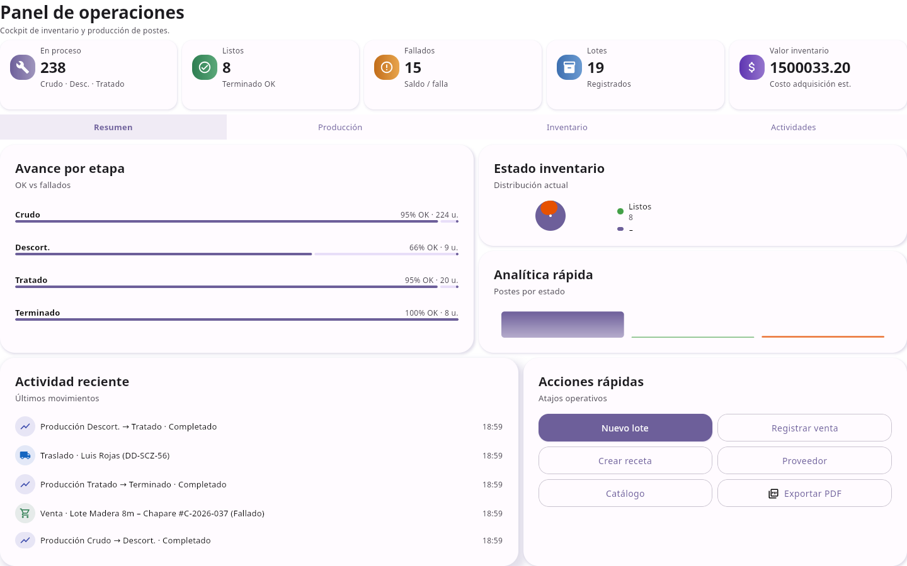

&nbsp;

---

**Preparado para:** [Nombre de la Empresa]

**Preparado por:** Postes Industriales ERP Team

**Version:** 2.0

**Fecha:** Julio 2026

**Plataforma:** Aplicacion de Escritorio Multiplataforma (Windows, macOS, Linux)

</div>

---

<div style="page-break-after: always;"></div>

## Indice

1. Resumen Ejecutivo
2. Problemas Actuales de la Industria
3. Por que Este Sistema
4. Tarjetas de Funcionalidades
5. Modulos Detallados
   - 5.1 Panel de Control
   - 5.2 Catalogo de Productos
   - 5.3 Inventario por Etapa
   - 5.4 Insumos y Materiales
   - 5.5 Recetas por Etapa
   - 5.6 Proveedores
   - 5.7 Traslados y Logistica
   - 5.8 Clientes
   - 5.9 Ventas y Facturacion
   - 5.10 Contabilidad
   - 5.11 Historial y Auditoria
6. Flujo de Costos
7. Escenarios de Negocio
8. Antes vs Despues
9. Flujo de Produccion
10. Retorno de Inversion
11. Flujo de Trabajo Recomendado
12. Diagramas de Procesos
13. Historia del Dashboard
14. Plan de Implementacion
15. Capacitacion
16. Modulos Futuros
17. Ventajas Competitivas
18. Inversion
19. Proximos Pasos
20. Apendice Tecnico

---

<div style="page-break-after: always;"></div>

## 1. Resumen Ejecutivo

<div style="background-color: #f0f4e8; padding: 20px; border-left: 4px solid #2D5016;">

> **En dos minutos:** Este documento presenta una solucion de software disenada especificamente para la industria de fabricacion y comercializacion de postes de madera tratada. El sistema digitaliza el proceso completo: desde la adquisicion de troncos en predios forestales, pasando por las etapas de produccion (descortezado, tratamiento quimico, acabado), hasta la venta y entrega al cliente final.

</div>

### El Problema

Las empresas de postes de madera operan actualmente con hojas de cálculo, cuadernos y sistemas fragmentados. No tienen visibilidad en tiempo real del inventario por etapa de produccion, los costos reales por poste son desconocidos, y el proceso de cotizacion y venta es lento y propenso a errores.

### Nuestra Solucion

**Postes Industriales ERP** ofrece una vista integral del negocio en una sola aplicacion:

| Capacidad | Beneficio Directo |
|-----------|-------------------|
| **Inventario trazable** por etapa de produccion | Sabe exactamente donde esta cada poste |
| **Costos reales** calculados automaticamente | Conoce el costo exacto por poste |
| **Ventas con margen** calculado en tiempo real | Cada venta muestra ganancia real |
| **Reportes PDF** generados con un clic | Informes profesionales en segundos |
| **Dashboard operativo** con KPIs | Decisiones basadas en datos reales |

### Valor para la Empresa

- **Reduccion de costos operativos** eliminando trabajo manual y errores
- **Aumento de ventas** con cotizaciones mas rapidas y precisas
- **Mejora de productividad** con informacion accesible en tiempo real
- **Mejores decisiones** basadas en datos reales, no estimaciones

> *"La digitalizacion no es un lujo — es una necesidad competitiva."*

---

<div style="page-break-after: always;"></div>

## 2. Problemas Actuales de la Industria

Las empresas de postes de madera enfrentan desafios diarios que impactan directamente la rentabilidad:

| Problema | Impacto | Consecuencia |
|----------|---------|--------------|
| **Inventario en Excel o cuadernos** | No hay visibilidad en tiempo real | Decisiones basadas en datos desactualizados |
| **Costos desconocidos** | No se sabe el costo real por poste | Margenes de ganancia estimados, no reales |
| **Sin trazabilidad** | No se puede rastrear un poste desde la compra hasta la venta | Problemas de garantia y calidad |
| **Ventas sin conocer rentabilidad** | Se vende sin saber si hay ganancia | Perdidas ocultas |
| **Produccion dificil de controlar** | No se sabe cuantos postes hay en cada etapa | Cuellos de botella no detectados |
| **Informacion dispersa** | Datos en multiple archivos y personas | Busqueda lenta de informacion |
| **Errores humanos** | Calculos manuales equivocados | Perdidas financieras |
| **Reportes manuales** | Horas de trabajo para generar un informe | Tiempo perdido, datos inconsistentes |
| **Sin alertas** | No se detecta stock bajo a tiempo | Interrupciones en produccion |

### Como el ERP Resuelve Cada Problema

| Problema | Solucion del ERP |
|----------|------------------|
| Inventario en Excel | Dashboard con KPIs actualizados en tiempo real |
| Costos desconocidos | Calculo automatico: materia prima + transporte + procesamiento |
| Sin trazabilidad | Historial completo de cada poste: origen, transformaciones, venta |
| Ventas sin rentabilidad | Margen calculado automaticamente por cada venta |
| Produccion sin control | Vista por etapa con cantidades y estados |
| Informacion dispersa | Base de datos unica y centralizada |
| Errores humanos | Validaciones automaticas y calculos exactos |
| Reportes manuales | Generacion de PDF con un clic |
| Sin alertas | Sistema de mensajes y notificaciones |

---

<div style="page-break-after: always;"></div>

## 3. Por que Este Sistema

No se trata solo de funcionalidades — se trata de como el sistema transforma las operaciones diarias:

| Beneficio | Descripcion |
|-----------|-------------|
| **Menos tiempo buscando informacion** | Todo esta en un solo lugar. No mas busqueda en multiples archivos de Excel. |
| **Menos errores** | Los calculos se hacen automaticamente. No mas errores de tipeo en formulas. |
| **Mayor control** | Sabe exactamente cuantos postes tiene, en que etapa estan, y cuanto valen. |
| **Costos reales** | Conoce el costo exacto de cada poste: materia prima + transporte + proceso. |
| **Mejor planificacion** | Toma decisiones basadas en datos reales, no en suposiciones. |
| **Reportes instantaneos** | Genera informes profesionales en segundos, no en horas. |
| **Trazabilidad completa** | Cada poste tiene un historial desde la compra hasta la venta. |
| **Margenes reales** | Cada venta muestra la ganancia real, no una estimacion. |
| **Operacion sin internet** | Funciona completamente sin conexion. Los datos estan seguros en su fabrica. |
| **Interfaz intuitiva** | Dise moderno y facil de usar. No requiere capacitacion extensa. |

### Ventajas Tecnologicas

| Caracteristica | Beneficio |
|----------------|-----------|
| **Sin servidor requerido** | Base de datos SQLite embebida. Sin costos de infraestructura. |
| **Multiplataforma** | Funciona en Windows, macOS y Linux. |
| **Sin dependencia de internet** | Operacion 100% local. Sus datos nunca salen de su fabrica. |
| **Respuesta instantanea** | Sin latencia de servidor. Todo es local y rapido. |
| **208 pruebas automatizadas** | Software confiable y probado. |

---

<div style="page-break-after: always;"></div>

## 4. Tarjetas de Funcionalidades

<div style="display: grid; grid-template-columns: 1fr 1fr; gap: 10px;">

📦 **Inventario por Etapa**
- Control en tiempo real
- Gestion por etapas
- Seguimiento de lotes
- Historial de produccion

---

💰 **Ventas y Facturacion**
- Calculo automatico de margenes
- Desglose de costos
- Historial de ventas
- Precio sugerido

---

🏭 **Control de Produccion**
- Transformacion entre etapas
- Postes fallados con precio de saldo
- Recetas estandarizadas
- Costos de procesamiento

---

🚚 **Logistica de Transporte**
- Registro de traslados
- Costos de flete y grua
- Distribucion proporcional
- Seguimiento de llegada

---

📊 **Dashboard Operativo**
- KPIs en tiempo real
- Graficos de inventario
- Actividad reciente
- Acciones rapidas

---

📑 **Reportes PDF**
- Inventario por etapa
- Detalle de ventas
- Contabilidad
- Rango de fechas configurable

---

📋 **Recetas por Etapa**
- Plantillas de consumo
- Calculo automatico
- Estandarizacion
- Notas y documentacion

---

👥 **Gestion de Contactos**
- Proveedores
- Clientes
- Choferes
- Directorio centralizado

---

📜 **Historial y Auditoria**
- Registro completo
- Trazabilidad
- Costos por evento
- Paginacion

---

🏦 **Contabilidad**
- Resumen financiero
- Costos acumulados
- Ventas por periodo
- Exportacion a PDF

</div>

---

<div style="page-break-after: always;"></div>
## 5. Modulos Detallados

---

### 5.1 Panel de Control


<div style="background-color: #f0f4e8; padding: 15px; border-left: 4px solid #2D5016;">

**Objetivo del Negocio:** Dar al gerente una vista completa del negocio en una sola pantalla, sin necesidad de buscar en multiples archivos o reportes.

</div>

#### Historia del Dashboard

Cada manana, el gerente de la planta abre el sistema y ve inmediatamente:

- **Cuantos postes tiene** en cada etapa de produccion
- **Cuanto vale** su inventario total
- **Cuanto ha vendido** este mes
- **Cual es el margen** promedio de ganancia
- **Que pas recientemente** (transformaciones, ventas, traslados)

Con esta informacion puede:

1. **Identificar cuellos de botella** — Si hay muchos postes en Crudo y pocos en Terminado, algo esta fallando en el proceso.
2. **Tomar decisiones rapidas** — Si el inventario esta bajo, puede ordenar mas troncos al proveedor.
3. **Monitorear rentabilidad** — Si el margen esta bajando, puede ajustar precios.
4. **Planificar produccion** — Sabe cuantos postes puede entregar esta semana.

#### KPIs Principales

| KPI | Que Mide | Por que Importa |
|-----|----------|-----------------|
| **Postes** | Total de postes en el sistema | Vista general del inventario |
| **En Inventario** | Postes disponibles para venta | Capacidad de entrega inmediata |
| **Valor Inventario** | Valor estimado total | Impacto financiero del inventario |
| **Procesamiento** | Costo acumulado de procesamiento | Control de costos operativos |
| **Ventas** | Monto total del mes | Ingresos del periodo |
| **Margen** | Porcentaje promedio de ganancia | Rentabilidad del negocio |

#### Graficos Incluidos

- **Distribucion por Etapa** — Visualiza donde estan sus postes en el proceso productivo
- **Costos Mensuales** — Evolucion de costos de procesamiento en el tiempo
- **Costos de Produccion** — Desglose por tipo de costo para identificar oportunidades de ahorro

#### Actividad Reciente

La pestana **Actividad** muestra las ultimas acciones: transformaciones completadas, ventas realizadas, y traslados. Esto permite al gerente mantenerse al tanto sin buscar en reportes.

#### Valor para el Negocio

> Los gerentes pueden tomar decisiones informadas en segundos, identificando cuellos de botella y oportunidades de mejora sin generar reportes manuales.

---

### 5.2 Catalogo de Productos

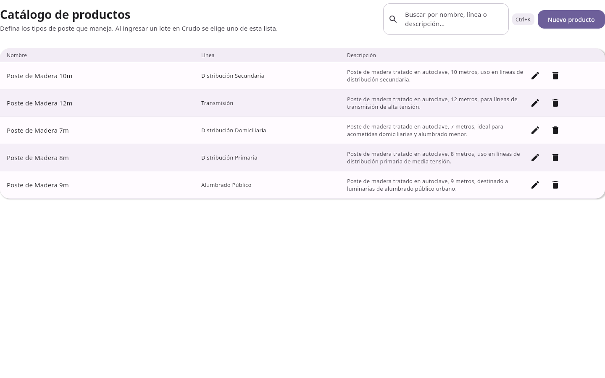

<div style="background-color: #f0f4e8; padding: 15px; border-left: 4px solid #2D5016;">

**Objetivo del Negocio:** Mantener un catalogo estandarizado de todos los tipos de postes que la empresa fabrica y comercializa, eliminando duplicados e inconsistencias.

</div>

#### Que Resuelve

Sin un catalogo centralizado, cada persona puede llamar al mismo poste de diferentes formas. Esto genera confusion en ventas, produccion y reportes.

#### Funcionalidades

| Accion | Que Hace | Beneficio |
|--------|----------|-----------|
| **Crear** | Agrega un nuevo tipo de poste | Catalogo siempre actualizado |
| **Editar** | Modifica nombre, linea o descripcion | Correccion de errores sin perder datos |
| **Eliminar** | Remueve tipos obsoletos | Catalogo limpio y relevante |
| **Buscar** | Filtra por nombre o linea | Encuentra rapidamente cualquier producto |

#### Lineas de Producto

El sistema permite definir lineas como:
- Distribucion Primaria
- Distribucion Secundaria
- Transcripcion
- Alumbrado Publico

#### Valor para el Negocio

> Estandarizacion de la informacion de productos, eliminando duplicados y inconsistencias en la definicion de postes.

---

### 5.3 Inventario por Etapa

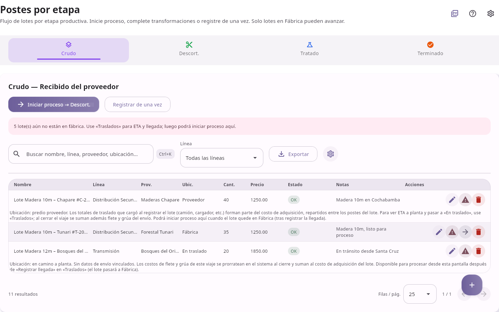

<div style="background-color: #f0f4e8; padding: 15px; border-left: 4px solid #2D5016;">

**Objetivo del Negocio:** Dar visibilidad completa de donde esta cada poste en el proceso productivo, permitiendo identificar rapidamente inventario estancado y postes con defectos.

</div>

#### Por que es la Pantalla Mas Importante

Esta es la pantalla donde pasa la mayor parte del tiempo el operador de produccion. Aqui se:

1. **Crea lotes** cuando llegan troncos del proveedor
2. **Transforma postes** de una etapa a otra
3. **Marca postes fallados** para venta a precio de saldo
4. **Monitorea el inventario** en cada etapa

#### Etapas de Produccion

| Etapa | Descripcion | Que Pasa Aqui |
|-------|-------------|---------------|
| **Crudo** | Troncos recien adquiridos del proveedor | Llegada y registro de materia prima |
| **Descortezado** | Troncos despellejados y secados | Preparacion para tratamiento |
| **Tratado** | Postes preservados quimicamente en autoclave | Proceso critico de preservacion |
| **Terminado** | Postes listos para entrega al cliente | Producto final listo para venta |

#### Flujo de Transformacion

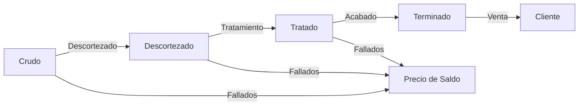

#### Crear un Nuevo Lote

1. Seleccione la pestana **"Crudo"**
2. Haga clic en **"+ Nuevo Lote"**
3. Complete la informacion:
   - **Nombre** — Identificador del lote
   - **Linea** — Linea de producto
   - **Cantidad** — Numero de postes
   - **Proveedor** — Proveedor de origen
   - **Costo por poste** — Precio de adquisicion
   - **Precio de venta estandar** — Precio para postes OK
   - **Precio de saldo** — Precio para postes fallados
   - **Ubicacion** — Fabrica, En Proveedor, En Transito

#### Transformar Postes

1. Seleccione un lote en la etapa origen
2. Haga clic en **"Transformar"**
3. Defina:
   - Cantidad a transformar
   - Cantidad exitosa y cantidad fallada
   - Duracion del proceso (horas)
   - Costos de procesamiento (se calculan de las recetas)
4. Confirme la transformacion

> **Nota:** Los postes fallados se mueven automaticamente a la etapa anterior con precio de saldo.

#### Valor para el Negocio

> Visibilidad completa de donde esta cada poste en el proceso productivo. Identificacion instantanea de inventario estancado y postes con defectos.

---

### 5.4 Insumos y Materiales

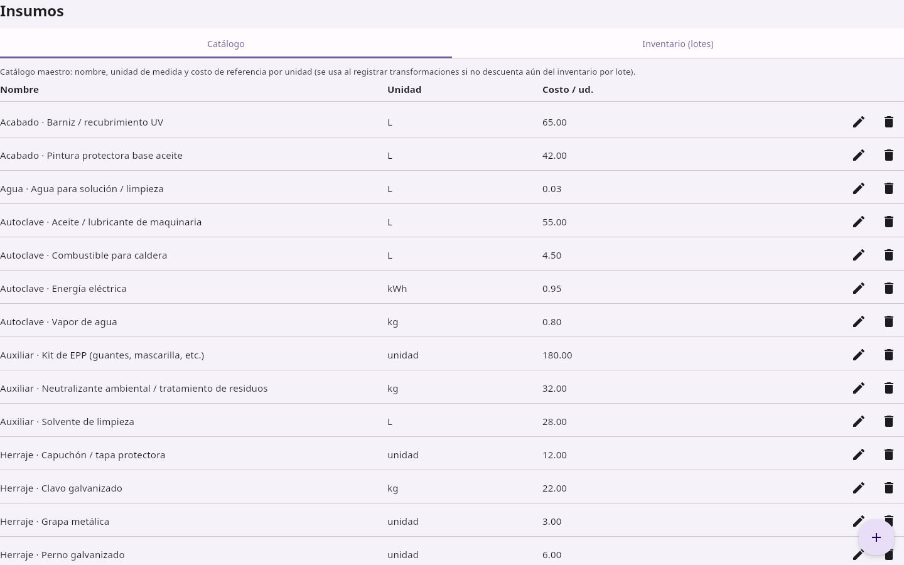

<div style="background-color: #f0f4e8; padding: 15px; border-left: 4px solid #2D5016;">

**Objetivo del Negocio:** Controlar el consumo de materiales por etapa de produccion, optimizando compras y reduciendo desperdicios.

</div>

#### Que Resuelve

Sin control de insumos, la empresa no sabe cuanta creosota, agua o electricidad consume por poste. Esto hace imposible calcular costos reales.

#### Categorias de Insumos

| Categoria | Ejemplos | Importancia |
|-----------|----------|-------------|
| **Materia prima** | Troncos | Componente principal del costo |
| **Preservantes** | CCA, CCB, Creosota, ACQ | Tratamiento quimico esencial |
| **Agua industrial** | Agua para proceso | Consumo continuo |
| **Energia** | Electricidad, combustible | Costos operativos |
| **Preparacion** | Parafina, pintura asfatica | Acabado y proteccion |
| **Herrajes** | Placas, pernos, capuchones | Componentes de instalacion |
| **Acabados** | Pintura protectora, barniz | Proteccion final |
| **Auxiliares** | Solvente, EPP, neutralizante | Seguridad y limpieza |

#### Crear un Insumo

1. Vaya a la pestana **"Catalogo"**
2. Haga clic en **"+ Nuevo Insumo"**
3. Complete: **Nombre**, **Unidad** (kg, L, unidad, kWh), **Costo por unidad**
4. Haga clic en **"Guardar"**

#### Registrar una Compra

1. Vaya a la pestana **"Inventario"**
2. Haga clic en **"+ Nueva Partida"**
3. Complete: Insumo, Cantidad, Precio por unidad, Fecha de vencimiento, Notas
4. Haga clic en **"Guardar"**

#### Valor para el Negocio

> Control preciso del consumo de materiales por etapa de produccion, permitiendo optimizar compras y reducir desperdicios.

---

### 5.5 Recetas por Etapa

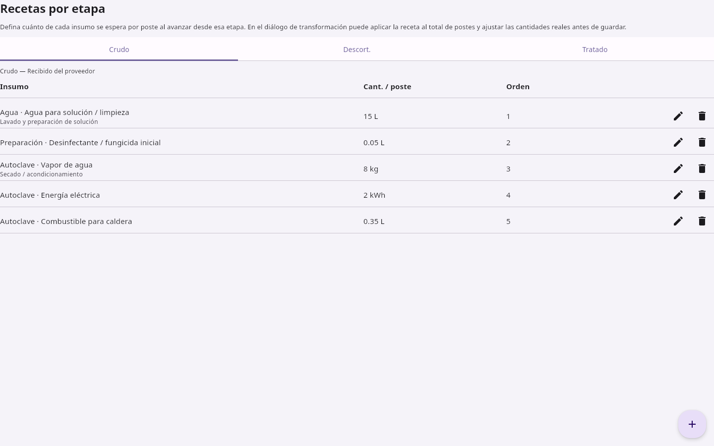

<div style="background-color: #f0f4e8; padding: 15px; border-left: 4px solid #2D5016;">

**Objetivo del Negocio:** Estandarizar el proceso productivo y permitir el calculo automatico de costos de procesamiento basado en recetas reales.

</div>

#### Que Resuelve

Sin recetas, cada operador puede usar cantidades diferentes de materiales. Esto genera costos inconsistentes y dificulta la planificacion.

#### Como Funciona

Las recetas definen cuanto de cada insumo se consume por poste en cada etapa. Cuando se crea una transformacion, el sistema usa las recetas para calcular automaticamente los costos de procesamiento.

#### Ejemplo de Receta: Crudo a Descortezado

| Insumo | Cantidad/Poste | Descripcion |
|--------|---------------|-------------|
| Agua | 15 L | Lavado y preparacion |
| Desinfectante | 0.05 L | Tratamiento inicial |
| Vapor | 8 kg | Secado |
| Electricidad | 2 kWh | Energia |
| Combustible | 0.35 L | Caldera |

#### Crear una Receta

1. Seleccione la **etapa de origen** (Crudo, Descortezado, o Tratado)
2. Haga clic en **"+ Nueva Receta"**
3. Complete: **Insumo**, **Cantidad por poste**, **Notas**
4. Haga clic en **"Guardar"**

#### Valor para el Negocio

> Estandarizacion del proceso productivo. Calculo automatico de costos de procesamiento basado en recetas reales.

---

### 5.6 Proveedores

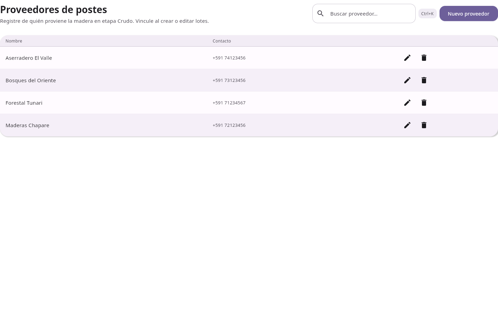

<div style="background-color: #f0f4e8; padding: 15px; border-left: 4px solid #2D5016;">

**Objetivo del Negocio:** Centralizar la informacion de proveedores para facilitar la gestion de relaciones comerciales y la comparacion de precios.

</div>

#### Que Resuelve

Sin un directorio centralizado, la informacion de proveedores esta dispersa en tarjetas, cuadernos y contactos de telefono.

#### Funcionalidades

| Accion | Que Hace |
|--------|----------|
| **Crear** | Registra nuevo proveedor con nombre, contacto y notas |
| **Editar** | Actualiza informacion cuando cambia |
| **Eliminar** | Remueve proveedores inactivos |
| **Buscar** | Filtra rapidamente por nombre |

#### Crear un Proveedor

1. Haga clic en **"+ Nuevo Proveedor"**
2. Complete: **Nombre**, **Contacto** (telefono +591), **Notas**
3. Haga clic en **"Guardar"**

#### Valor para el Negocio

> Centralizacion de la informacion de proveedores, facilitando la gestion de relaciones comerciales y la comparacion de precios.

---

### 5.7 Traslados y Logistica

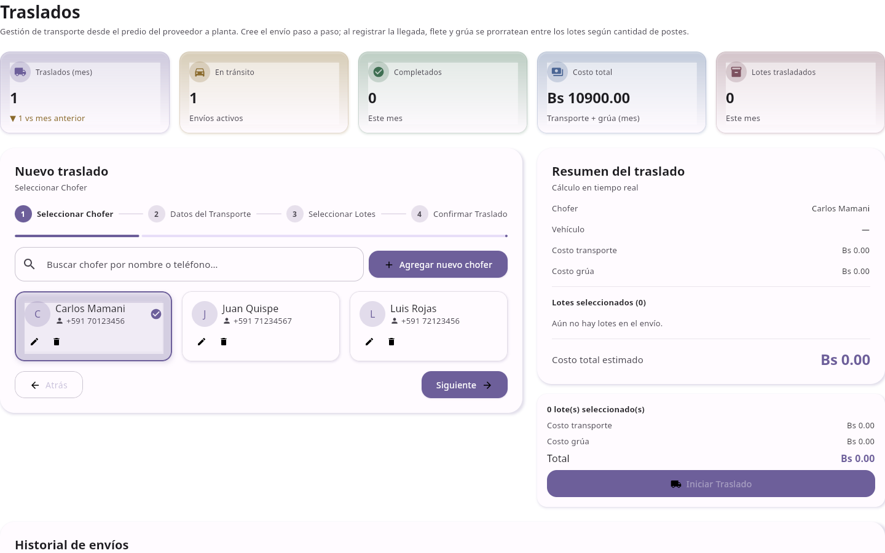

<div style="background-color: #f0f4e8; padding: 15px; border-left: 4px solid #2D5016;">

**Objetivo del Negocio:** Controlar totalmente la logistica de adquisicion, con trazabilidad de costos de transporte por lote de postes.

</div>

#### Que Resuelve

Sin registro de traslados, la empresa no sabe cuanto gasta en transporte por lote. Los costos se pierden o se estiman incorrectamente.

#### Estados del Traslado

| Estado | Descripcion |
|--------|-------------|
| **En Progreso** | El traslado esta en curso |
| **Completado** | Los lotes llegaron a la fabrica |

#### Crear un Traslado

1. Haga clic en **"+ Nuevo Traslado"**
2. Complete la informacion del traslado:
   - **Chofer** — Seleccione o cree uno nuevo
   - **Placa del vehiculo** — Formato: BB-LPV-12
   - **Fecha de salida** — Fecha programada
   - **Fecha de llegada estimada**
   - **Costo de flete** — Monto del flete
   - **Costo de grua** — Monto de la grua
   - **Notas** — Referencia del traslado
3. Seleccione los **lotes** a trasladar
4. Confirme el traslado

#### Distribucion de Costos

Los costos de transporte se distribuyen proporcionalmente entre los lotes segun su cantidad. Esto permite conocer el costo de transporte exacto por poste.

#### Valor para el Negocio

> Control total de la logistica de adquisicion, con trazabilidad de costos de transporte por lote de postes.

---

### 5.8 Clientes

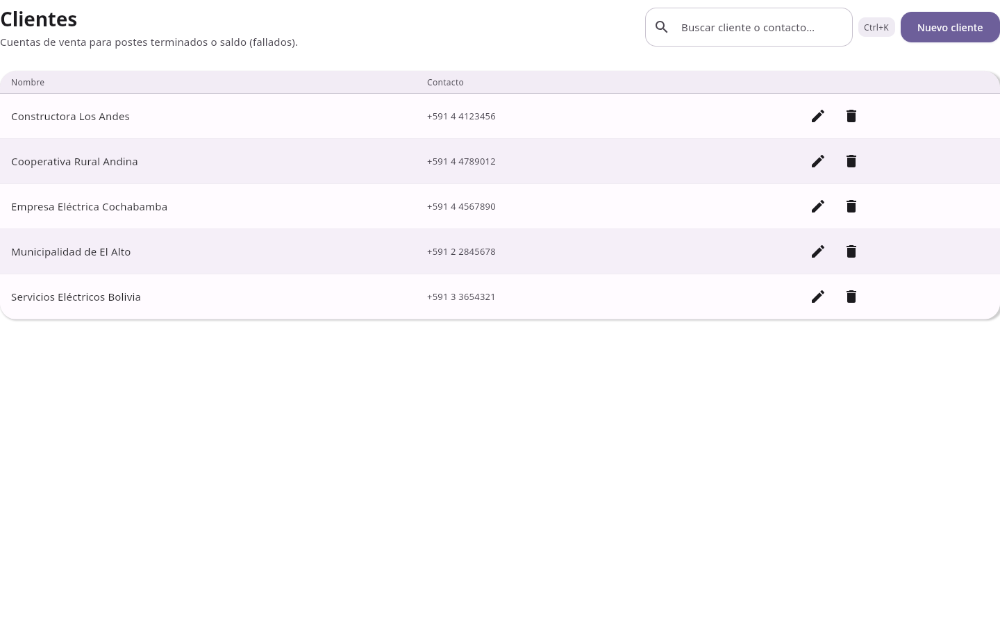

<div style="background-color: #f0f4e8; padding: 15px; border-left: 4px solid #2D5016;">

**Objetivo del Negocio:** Mantener una base de datos organizada de clientes para agilizar el proceso de venta y seguimiento comercial.

</div>

#### Que Resuelve

Sin un directorio de clientes, cada venta requiere buscar datos de contacto, historial y preferencias en multiples lugares.

#### Funcionalidades

| Accion | Que Hace |
|--------|----------|
| **Crear** | Registra nuevo cliente con nombre, contacto y notas |
| **Editar** | Actualiza informacion del cliente |
| **Eliminar** | Remueve clientes inactivos |
| **Buscar** | Filtra rapidamente por nombre |

#### Crear un Cliente

1. Haga clic en **"+ Nuevo Cliente"**
2. Complete: **Nombre**, **Contacto** (telefono), **Notas**
3. Haga clic en **"Guardar"**

#### Valor para el Negocio

> Base de datos organizada de clientes para agilizar el proceso de venta y seguimiento comercial.

---

### 5.9 Ventas y Facturacion

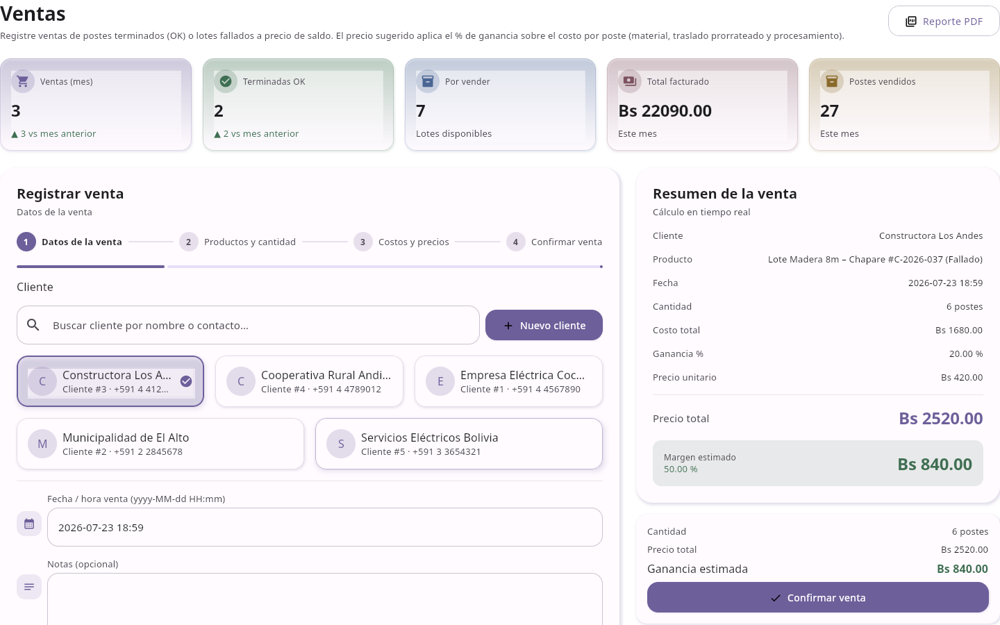

<div style="background-color: #f0f4e8; padding: 15px; border-left: 4px solid #2D5016;">

**Objetivo del Negocio:** Registrar ventas con estimacion completa de costos y margenes de ganancia, permitiendo analisis de rentabilidad por producto, cliente o periodo.

</div>

#### Que Resuelve

Sin control de costos, la empresa vende sin saber si hay ganancia. Algunas ventas pueden ser rentables y otras no, pero no hay forma de saberlo.

#### Flujo de Venta (Paso a Paso)

**Paso 1: Seleccionar Cliente**

1. Haga clic en **"+ Nueva Venta"**
2. Seleccione el cliente de la lista

**Paso 2: Seleccionar Productos**

1. Busque y seleccione los postes a vender
2. Defina la **cantidad** de cada lote
3. El sistema muestra el **precio de referencia** por poste

**Paso 3: Definir Precio**

1. Ingrese el **monto total** a cobrar
2. O haga clic en **"Usar precio sugerido"** para calcular automaticamente
3. El sistema muestra:
   - **Precio por unidad**
   - **Margen estimado** (% y monto)
   - **Desglose de costos:**
     - Adquisicion (material)
     - Transporte
     - Procesamiento

**Paso 4: Confirmar**

1. Revise el resumen de la venta
2. Haga clic en **"Registrar Venta"**
3. La venta queda registrada en el historial

#### Historial de Ventas

Las ventas anteriores se muestran en la parte inferior de la pantalla con:
- Fecha y cliente
- Cantidad y monto total
- Costos snapshot (guardados al momento de la venta)

#### Eliminar una Venta

1. Haga clic en el **icono de papelera** de la venta
2. Confirme la eliminacion
3. El inventario se repone automaticamente

#### Valor para el Negocio

> Cada venta se registra con toda la informacion de costos, permitiendo analisis de rentabilidad por producto, cliente o periodo.

---

### 5.10 Contabilidad

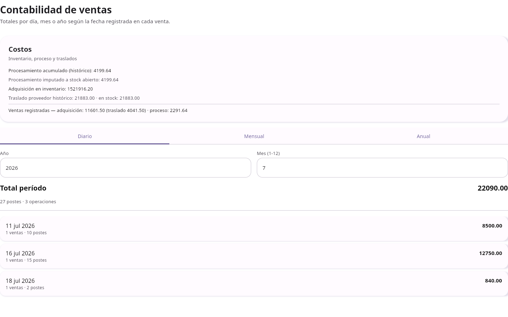

<div style="background-color: #f0f4e8; padding: 15px; border-left: 4px solid #2D5016;">

**Objetivo del Negocio:** Dar una vision financiera clara para la toma de decisiones estrategicas, sin necesidad de contadores externos para reportes operativos.

</div>

#### Que Resuelve

Sin un resumen financiero, el gerente no sabe cuanto ha gastado en produccion, cuanto ha vendido, y cual es la ganancia real.

#### Metricas Disponibles

| Metrica | Descripcion |
|---------|-------------|
| **Procesamiento Acumulado** | Costo total historico de procesamiento |
| **Procesamiento en Stock** | Costo de procesamiento en lotes abiertos |
| **Adquisicion en Inventario** | Costo de materia prima en stock |
| **Traslado Historico** | Costos totales de transporte |
| **Traslado en Stock** | Costos de transporte en lotes abiertos |
| **Ventas Registradas** | Ingresos totales por ventas |

#### Agregacion por Periodo

- **Diario** — Resumen del dia actual
- **Mensual** — Resumen del mes actual
- **Anual** — Resumen del ano actual

#### Exportar a PDF

1. Haga clic en **"Exportar PDF"**
2. Seleccione la ubicacion del archivo
3. El reporte se genera automaticamente

#### Valor para el Negocio

> Vision financiera clara para la toma de decisiones estrategicas, sin necesidad de contadores externos para reportes operativos.

---

### 5.11 Historial y Auditoria

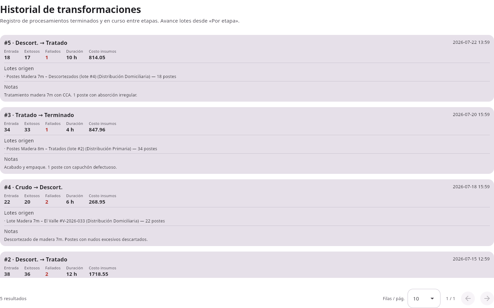

<div style="background-color: #f0f4e8; padding: 15px; border-left: 4px solid #2D5016;">

**Objetivo del Negocio:** Proporcionar trazabilidad completa del proceso productivo, esencial para auditorias, garantias y mejora de procesos.

</div>

#### Que Resuelve

Sin historial, la empresa no puede demostrar que un poste fue tratado correctamente o cuando se entrego al cliente.

#### Tipos de Eventos

| Evento | Descripcion |
|--------|-------------|
| **Transformacion** | Movimiento entre etapas de produccion |
| **Venta** | Registro de venta a cliente |
| **Traslado** | Transporte desde proveedor |

#### Informacion por Evento

Cada registro incluye:
- **Fecha y hora** del evento
- **Tipo** de operacion
- **Detalles** (etapa origen -> destino, cantidades)
- **Costos** asociados
- **Notas** adicionales

#### Paginacion

Use los controles inferiores para navegar entre paginas del historial.

#### Valor para el Negocio

> Trazabilidad completa del proceso productivo, esencial para auditorias, garantias y mejora de procesos.

---

<div style="page-break-after: always;"></div>
## 6. Flujo de Costos

El ERP calcula automaticamente el costo real de cada poste siguiendo este flujo:

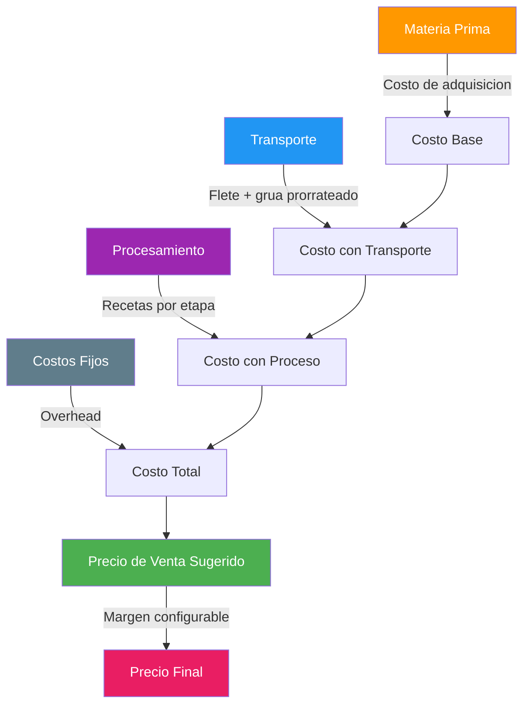

### Desglose del Costo por Poste

| Componente | Que Incluye | Como se Calcula |
|------------|-------------|-----------------|
| **Materia Prima** | Troncos del proveedor | Costo de adquisicion por poste |
| **Transporte** | Flete + grua desde predio | Costo total / cantidad de postes |
| **Procesamiento** | Materiales de receta por etapa | Suma de (cantidad x precio) de cada insumo |
| **Costo Total** | Suma de todos los anteriores | Materia Prima + Transporte + Procesamiento |

### Ejemplo Real

Para un lote de 100 postes de 8 metros:

| Concepto | Monto |
|----------|-------|
| Troncos (100 x Bs 350) | Bs 35,000 |
| Transporte (flete + grua) | Bs 8,500 |
| Procesamiento (recetas) | Bs 12,400 |
| **Costo Total** | **Bs 55,900** |
| **Costo por Poste** | **Bs 559** |
| Precio de Venta (con 25% margen) | **Bs 699** |

---

## 7. Escenarios de Negocio

### Escenario 1: Llegada de Troncos del Proveedor

**Situacion:** Un camion llega con 200 troncos del proveedor "Maderas Chapare".

| Paso | Accion en el ERP | Beneficio |
|------|------------------|-----------|
| 1 | Crear Lote en etapa "Crudo" | Registro inmediato del inventario |
| 2 | Asignar proveedor y costo por poste | Costo de adquisicion documentado |
| 3 | Registrar Traslado con chofer y costos | Transporte prorrateado por lote |
| 4 | Completar traslado | Lotes actualizados a "En Fabrica" |

**Resultado:** La empresa sabe exactamente cuantos troncos llegaron, de quien, a que costo, y cuanto costó transportarlos.

### Escenario 2: Transformacion de Produccion

**Situacion:** 150 postes del lote "Chapare-2026" van a ser descortezados.

| Paso | Accion en el ERP | Beneficio |
|------|------------------|-----------|
| 1 | Seleccionar lote en "Crudo" | Identificacion del lote |
| 2 | Clic en "Transformar" | Asistente guiado |
| 3 | Definir: 150 a transformar, 140 exitosos, 10 fallados | Controles exactos |
| 4 | Sistema calcula costos de receta automaticamente | Costos exactos sin calculo manual |
| 5 | Confirmar | Inventario actualizado |

**Resultado:** 140 postes pasan a "Descortezado" con costos calculados. 10 postes fallados se marcan con precio de saldo.

### Escenario 3: Venta a Cliente

**Situacion:** "Empresa Electrica Cochabamba" quiere comprar 50 postes de 8 metros.

| Paso | Accion en el ERP | Beneficio |
|------|------------------|-----------|
| 1 | Seleccionar cliente | Datos del cliente cargados |
| 2 | Seleccionar 50 postes del lote "Chapare-2026" | Postes disponibles identificados |
| 3 | Sistema muestra precio sugerido y margen | Decision informada |
| 4 | Definir precio de venta | Margen calculado automaticamente |
| 5 | Confirmar venta | Inventario reducido, venta registrada |

**Resultado:** La empresa vende sabiendo exactamente cuanto gano. El historial muestra el desglose completo de costos.

### Escenario 4: Cierre Mensual

**Situacion:** El gerente quiere ver el resumen financiero del mes.

| Paso | Accion en el ERP | Beneficio |
|------|------------------|-----------|
| 1 | Ir a Contabilidad | Vista consolidada |
| 2 | Seleccionar periodo "Mensual" | Datos del mes actual |
| 3 | Revisar metricas | Costos, ventas, margen |
| 4 | Exportar PDF | Reporte profesional |

**Resultado:** En segundos el gerente tiene un reporte completo para tomar decisiones estrategicas.

### Escenario 5: Auditoria de Calidad

**Situacion:** Un cliente reclama que un poste no fue tratado correctamente.

| Paso | Accion en el ERP | Beneficio |
|------|------------------|-----------|
| 1 | Ir a Historial | Registro completo |
| 2 | Buscar el lote del poste | Trazabilidad |
| 3 | Ver transformaciones y costos | Evidencia documentada |
| 4 | Verificar tratamiento completo | Garantia respaldada |

**Resultado:** La empresa puede demostrar documentalmente que el poste fue tratado segun especificaciones.

---

## 8. Antes vs Despues

### Inventario

| Antes (Sin ERP) | Despues (Con ERP) |
|-----------------|-------------------|
| Inventario en cuadernos | Dashboard con KPIs actualizados |
| Busqueda de datos en multiples archivos | Todo en un solo lugar |
| Datos desactualizados | Informacion en tiempo real |
| Sin saber cuantos postes hay en cada etapa | Vista por etapa con cantidades exactas |

### Costos

| Antes (Sin ERP) | Despues (Con ERP) |
|-----------------|-------------------|
| Costo real desconocido | Costo por poste calculado (material + transporte + proceso) |
| Margenes a estimar | Margen real calculado por venta |
| Sin analisis de rentabilidad | Rentabilidad por cliente, producto y periodo |
| Calculos manuales en Excel | Calculos automaticos y exactos |

### Produccion

| Antes (Sin ERP) | Despues (Con ERP) |
|-----------------|-------------------|
| Seguimiento en cuadernos | Vista por etapa con cantidades |
| Sin trazabilidad de fallas | Postes fallados registrados con precio de saldo |
| Recetas inconsistentes | Plantillas estandarizadas por etapa |
| Sin historial de transformaciones | Registro completo de cada transformacion |

### Ventas

| Antes (Sin ERP) | Despues (Con ERP) |
|-----------------|-------------------|
| Ventas registradas sin costos | Cada venta con desglose de costos |
| Sin saber si hay ganancia | Margen calculado automaticamente |
| Cotizaciones lentas | Precio sugerido instantaneo |
| Sin historial de clientes | Directorio centralizado |

### Logistica

| Antes (Sin ERP) | Despues (Con ERP) |
|-----------------|-------------------|
| Traslados sin registro | Cada traslado documentado con costos |
| Costos de transporte perdidos | Costos prorrateados por lote |
| Sin seguimiento de llegada | Estados y fechas estimadas |
| Choferes sin directorio | Directorio de choferes |

### Reportes

| Antes (Sin ERP) | Despues (Con ERP) |
|-----------------|-------------------|
| Reportes manuales semanales | Reportes PDF con un clic |
| Horas de trabajo para generar un informe | Segundos para generar un informe |
| Datos inconsistentes entre reportes | Datos consistentes de una sola fuente |
| Sin posibilidad de analisis historico | Historial completo y consultable |

---

<div style="page-break-after: always;"></div>

## 9. Flujo de Produccion


### Etapas Detalladas

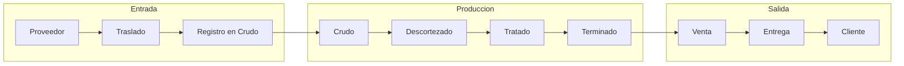

---

<div style="page-break-after: always;"></div>

## 10. Retorno de Inversion

### Beneficios Cuantificables

| Area | Mejora Esperada | Impacto |
|------|-----------------|---------|
| **Reduccion de papel** | Eliminacion de cuadernos y planillas | Menos tiempo buscando informacion |
| **Menos errores de inventario** | Control exacto por etapa | Menos perdidas por datos incorrectos |
| **Cotizaciones mas rapidas** | Precio sugerido instantaneo | Mayor numero de ventas cerradas |
| **Costos operativos reducidos** | Calculos automaticos | Menos horas de trabajo administrativo |
| **Mejor planificacion de produccion** | Visibilidad en tiempo real | Menos cuellos de botella |
| **Mejor servicio al cliente** | Informacion accesible | Mayores ventas repetidas |

### Beneficios Intangibles

| Beneficio | Descripcion |
|-----------|-------------|
| **Trazabilidad** | Capacidad de demostrar calidad y proceso |
| **Decisiones informadas** | Datos reales, no suposiciones |
| **Competitividad** | Empresa moderna y digitalizada |
| **Escalabilidad** | Sistema preparado para crecer |
| **Cumplimiento** | Registros completos para auditorias |

### Ejempo Practico de ROI

**Situacion actual (estimada):**
- 1 gerente de produccion dedicando 4 horas/semana a buscar datos
- 1 administrador dedicando 6 horas/semana a generar reportes manuales
- 2-3 errores de inventario al mes que cuestan Bs 2,000-5,000

**Con el ERP:**
- Datos disponibles en tiempo real (0 horas buscando)
- Reportes generados en segundos (0 horas generando)
- Errores reducidos significativamente

> **Nota:** Estos son estimaciones conservadoras. Los beneficios reales dependen del tamano de la operacion y la adopcion del sistema.

---

<div style="page-break-after: always;"></div>

## 11. Flujo de Trabajo Recomendado

```
1. Registrar Proveedores
       ↓
2. Crear Lotes (Crudo)
       ↓
3. Registrar Traslados
       ↓
4. Transformar: Crudo → Descortezado
       ↓
5. Transformar: Descortezado → Tratado
       ↓
6. Transformar: Tratado → Terminado
       ↓
7. Registrar Ventas
       ↓
8. Revisar Contabilidad
```

### Consejos para una Buena Implementacion

1. **Empiece con el catalogo** — Defina todos los tipos de postes antes de crear lotes
2. **Use recetas** — Las recetas permiten calculos automaticos de costos
3. **Registre todos los traslados** — Los costos de transporte afectan el precio final
4. **Revise el Panel diariamente** — Los KPIs muestran el estado del negocio
5. **Exporte reportes mensualmente** — Para analisis y auditoria

---

<div style="page-break-after: always;"></div>

## 12. Diagramas de Procesos

### Flujo de Inventario

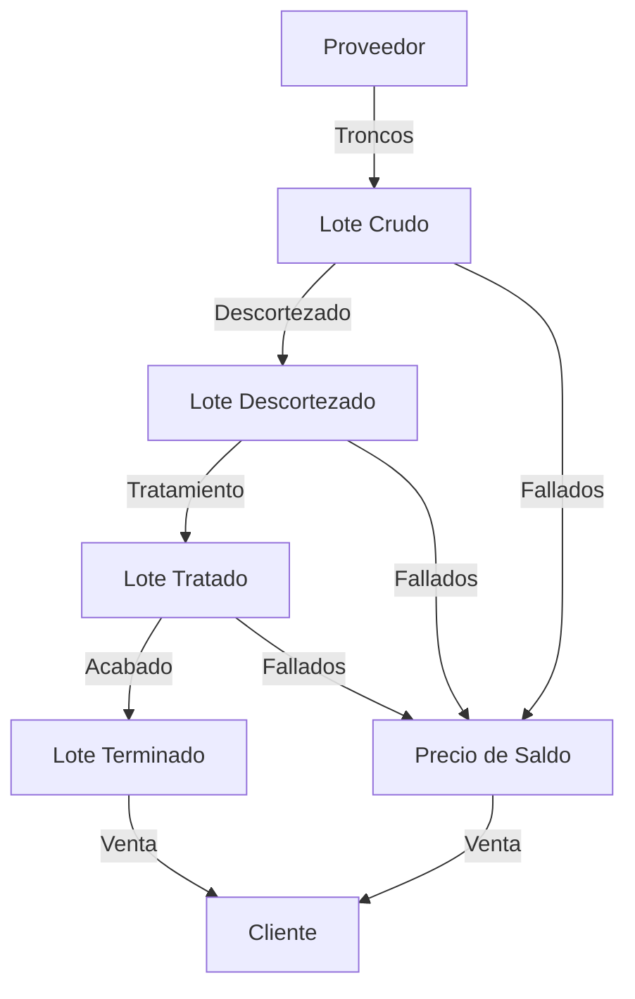

### Flujo de Costos

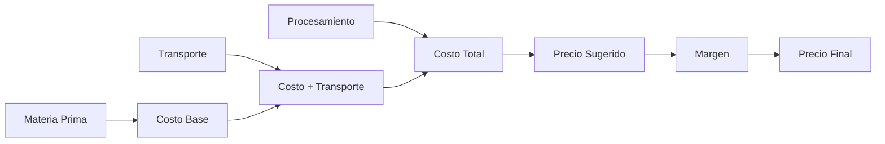

### Flujo de Ventas

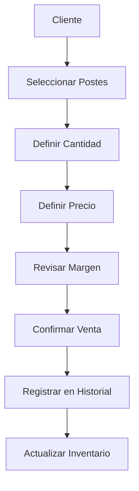

---

<div style="page-break-after: always;"></div>

## 13. Historia del Dashboard

### Manana Tipica del Gerente

**7:00 AM** — El gerente abre el sistema desde su oficina.

**7:01 AM** — Ve el Dashboard:
- **350 postes** en inventario total
- **120 postes** disponibles para venta
- **Bs 85,000** valor del inventario
- **Bs 12,400** ventas este mes
- **22%** margen promedio

**7:02 AM** — Identifica que hay muchos postes en "Crudo" y pocos en "Terminado".

**7:03 AM** — Decide priorizar la transformacion de Crudo a Descortezado.

**7:05 AM** — Revisa la actividad reciente:
- Ayer se completaron 80 transformaciones
- Se registro una venta de Bs 45,000
- Hay un traslado en progreso

**Decisiones Tomadas:**
1. Autorizar mas horas extraordinarias para produccion
2. Seguir el traslado pendiente
3. Revisar margen de ventas recientes

**Tiempo total: 5 minutos** para tener una vision completa del negocio.

### Sin el ERP (Antes)

**7:00 AM** — El gerente llega a la oficina.

**7:05 AM** — Busca el cuaderno de inventario.

**7:10 AM** — Llama al operador de produccion para saber cuantos postes hay.

**7:15 AM** — Busca las planillas de ventas en Excel.

**7:20 AM** — Calcula el margen manualmente.

**7:30 AM** — Aun no tiene toda la informacion.

**Tiempo total: 30+ minutos** y aun con datos potencialmente incorrectos.

---

<div style="page-break-after: always;"></div>

## 14. Plan de Implementacion

### Fase 1: Instalacion (Semana 1)

| Dia | Actividad | Duracion |
|-----|-----------|----------|
| Lunes | Instalacion del software | 2 horas |
| Martes | Configuracion inicial | 1 hora |
| Miercoles | Carga de datos iniciales | 2 horas |
| Jueves | Pruebas de funcionamiento | 2 horas |
| Viernes | Ajustes y correcciones | 2 horas |

### Fase 2: Capacitacion (Semana 2)

| Dia | Actividad | Duracion |
|-----|-----------|----------|
| Lunes | Capacitacion de administrador | 4 horas |
| Martes | Capacitacion de operadores | 4 horas |
| Miercoles | Capacitacion de ventas | 3 horas |
| Jueves | Capacitacion de contabilidad | 2 horas |
| Viernes | Practica supervisada | 4 horas |

### Fase 3: Piloto (Semana 3)

| Dia | Actividad | Duracion |
|-----|-----------|----------|
| Lunes | Operacion con datos reales ( modo supervision) | Todo el dia |
| Martes | Operacion con datos reales (modo supervision) | Todo el dia |
| Miercoles | Operacion con datos reales (modo supervision) | Todo el dia |
| Jueves | Revision y ajustes | 4 horas |
| Viernes | Capacitacion adicional segun necesidad | 3 horas |

### Fase 4: Produccion (Semana 4)

| Dia | Actividad | Duracion |
|-----|-----------|----------|
| Lunes | Operacion independiente | Todo el dia |
| Martes | Operacion independiente | Todo el dia |
| Miercoles | Soporte tecnico remoto | Disponible |
| Jueves | Revision de primer mes | 2 horas |
| Viernes | Documentacion de aprendizajes | 2 horas |

### Criticos de Exito

- **Compromiso de la gerencia** — Apoyo visible durante la implementacion
- **Datos iniciales correctos** — Carga cuidadosa de proveedores, clientes y productos
- **Capacitacion suficiente** — Tiempo adecuado para que el personal aprenda
- **Operacion gradual** — No cambiar todo de golpe

---

<div style="page-break-after: always;"></div>

## 15. Capacitacion

### Niveles de Capacitacion

| Nivel | Audiencia | Duracion | Contenido |
|-------|-----------|----------|-----------|
| **Administrador** | Gerente de planta, administrador | 4 horas | Configuracion, reportes, gestion completa |
| **Operadores** | Personal de produccion | 4 horas | Inventario, transformaciones, recetas |
| **Ventas** | Personal comercial | 3 horas | Clientes, ventas, cotizaciones |
| **Contabilidad** | Personal financiero | 2 horas | Reportes, resumen financiero |

### Contenido por Nivel

**Administrador (4 horas)**
- Configuracion del sistema
- Gestion de usuarios (futuro)
- Generacion de reportes
- Interpretacion de KPIs
- Respaldos de base de datos

**Operadores (4 horas)**
- Crear y editar lotes
- Transformar postes entre etapas
- Marcar postes fallados
- Uso de recetas
- Consulta de inventario

**Ventas (3 horas)**
- Gestion de clientes
- Registro de ventas
- Calculo de margenes
- Historial de ventas
- Exportacion de reportes

**Contabilidad (2 horas)**
- Resumen financiero
- Costos acumulados
- Ventas por periodo
- Exportacion a PDF

### Metodo de Capacitacion

- **Sesion presencial** con ejercicios practicos
- **Datos demo** para practicar sin riesgo
- **Manual de usuario** como referencia continua
- **Soporte tecnico** post-implementacion

---

<div style="page-break-after: always;"></div>

## 16. Modulos Futuros

### Funcionalidades Actuales (Version 1.0)

| Modulo | Estado |
|--------|--------|
| Panel de Control (Dashboard) | Completado |
| Catalogo de Productos | Completado |
| Inventario por Etapa | Completado |
| Insumos y Materiales | Completado |
| Recetas por Etapa | Completado |
| Proveedores | Completado |
| Traslados y Logistica | Completado |
| Clientes | Completado |
| Ventas y Facturacion | Completado |
| Contabilidad | Completado |
| Historial y Auditoria | Completado |
| Reportes PDF | Completado |
| Manejo de Errores | Completado |
| Localizacion Bolivia | Completado |

### Funcionalidades Futuras (Roadmap)

| Mejora | Descripcion | Prioridad | Impacto |
|--------|-------------|-----------|---------|
| **Validacion de Entradas** | Validacion en tiempo real de todos los formularios | Alta | Menos errores |
| **Codigos de Barras** | Escaneo de lotes y productos | Media | Rapidez en registro |
| **Sincronizacion en la Nube** | Backup y acceso remoto | Media | Seguridad de datos |
| **Gestion de Usuarios** | Roles y permisos por usuario | Alta | Seguridad |
| **Notificaciones** | Alertas de stock bajo y vencimientos | Media | Prevencion |
| **Analisis Avanzado** | Reportes de tendencias y predicciones | Baja | Estrategia |
| **Formato de Fechas** | Adaptacion a formato boliviano (dd/MM/yyyy) | Baja | Localizacion |
| **Validacion de Telefonos** | Formato +591 + 8 digitos | Baja | Calidad de datos |
| **App Movil** | Version para tabletas en planta | Media | Movilidad |
| **QR Codes** | Codigos QR en postes para rastreo | Baja | Trazabilidad |

---

<div style="page-break-after: always;"></div>

## 17. Ventajas Competitivas

| Ventaja | Descripcion |
|---------|-------------|
| **Aplicacion de Escritorio** | Funciona sin conexion a internet. Los datos estan seguros en la fabrica. |
| **Interfaz Moderna** | Diseno profesional con Compose Desktop, intuitivo y atractivo. |
| **Operacion Rapida** | Base de datos SQLite local. Respuesta instantanea sin latencia de servidor. |
| **Flujo Simplificado** | Asistentes de transformacion y venta guian al usuario paso a paso. |
| **Trazabilidad Completa** | Cada poste tiene historial de costos, transformaciones y ubicacion. |
| **Costos en Tiempo Real** | Calculo automatico de costo por poste: material + transporte + proceso. |
| **Historial de Produccion** | Registro auditable de cada transformacion con conteos y duracion. |
| **Reportes PDF** | Generacion profesional de informes de inventario, ventas y produccion. |
| **Arquitectura Modular** | Facil de mantener, extender y personalizar. |
| **Localizacion Bolivia** | Moneda en Bolivianos (Bs), telefonos +591, datos demo bolivianos. |
| **208 Pruebas** | Software confiable y probado. |
| **Sin Servidor** | Sin costos de infraestructura. Todo es local. |
| **Multiplataforma** | Windows, macOS y Linux. |

---

<div style="page-break-after: always;"></div>

## 18. Inversion

### Lo que Incluye

- Aplicacion de escritorio completa (Windows, macOS, Linux)
- Base de datos SQLite embebida (sin servidor requerido)
- 11 modulos funcionales
- Sistema de reportes PDF
- Datos demo con precios reales de Bolivia
- Codigo fuente completo y documentado
- 208 pruebas automatizadas
- Arquitectura extensible para futuras mejoras
- Manual de usuario en PDF
- Documentacion tecnica completa

### Requisitos del Sistema

| Componente | Requisito |
|------------|-----------|
| Sistema Operativo | Windows 10+, macOS 12+, Linux (Ubuntu 20+) |
| RAM | 4 GB minimo, 8 GB recomendado |
| Disco | 500 MB de espacio libre |
| Resolucion | 1280 x 720 minimo, 1920 x 1080 recomendado |
| Java | JDK 17+ (incluido en el instalador) |

---

<div style="page-break-after: always;"></div>

## 19. Proximos Pasos

### Para Avanzar con Este Proyecto

1. **Revision de esta propuesta** — Responder preguntas y aclarar requisitos
2. **Demostracion en vivo** — Ver el sistema funcionando con datos demo
3. **Personalizacion** — Ajustar el sistema a las necesidades especificas
4. **Contrato de implementacion** — Definir alcance, tiempos y costos
5. **Inicio del proyecto** — Comenzar con la fase de instalacion

### Contacto

Para mas informacion o una demostracion personalizada:

- **Email:** [email de contacto]
- **Telefono:** [numero de contacto]
- **Web:** [sitio web]

> *"La mejor manera de evaluar el sistema es verlo funcionando con sus propios datos."*

---

<div style="page-break-after: always;"></div>

## 20. Apendice Tecnico

### Arquitectura General

El sistema sigue los principios de **Clean Architecture** y **MVVM** (Model-View-ViewModel), separando claramente la logica de negocio, el acceso a datos y la presentacion.

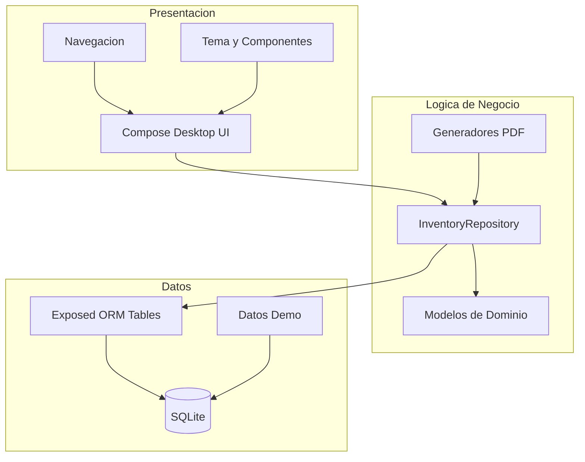

### Stack Tecnologico

| Componente | Tecnologia | Version | Proposito |
|------------|-----------|---------|-----------|
| **Lenguaje** | Kotlin | 2.0.21 | Lenguaje principal |
| **UI Framework** | Compose Desktop | 1.7.3 | Interfaz de usuario declarativa |
| **Base de Datos** | SQLite | 3.47.1 | Almacenamiento local |
| **ORM** | Exposed | 0.55.0 | Mapeo objeto-relacional |
| **Pool de Conexiones** | HikariCP | — | Gestion de conexiones DB |
| **Coroutines** | Kotlin Coroutines | 1.9.0 | Programacion asincrona |
| **PDF** | Apache PDFBox | 2.0.31 | Generacion de reportes PDF |
| **Testing** | JUnit 5 + JUnit 4 | 5.10.2 | Pruebas unitarias y UI |
| **Testing UI** | Compose Testing | 1.7.3 | Pruebas de interfaz |
| **JVM** | OpenJDK | 17 | Plataforma de ejecucion |

### Base de Datos

#### Tablas (15 total)

| Tabla | Registros Demo | Proposito |
|-------|---------------|-----------|
| `catalog_products` | 5 | Catalogo maestro de tipos de postes |
| `pole_providers` | 4 | Proveedores de materia prima |
| `clients` | 5 | Clientes de la empresa |
| `products` | 9+ | Lotes de inventario en produccion |
| `drivers` | 3 | Choferes de transporte |
| `provider_transport_runs` | 3 | Traslados de proveedores |
| `provider_transport_run_products` | 5 | Relacion traslado-lotes |
| `acquisition_transport_costs` | 6 | Costos de transporte por lote |
| `resources` | 28 | Catalogo de insumos |
| `resource_stock_lots` | 150+ | Lotes de inventario de insumos |
| `stage_resource_templates` | 14 | Recetas por etapa |
| `transformations` | 5 | Eventos de transformacion |
| `transformation_inputs` | 5 | Lotes consumidos por transformacion |
| `process_costs` | 50+ | Costos de procesamiento |
| `sales` | 3 | Ventas registradas |

#### Configuracion de Base de Datos

- **Motor:** SQLite embebido (sin servidor)
- **Archivo:** `~/.inventory-industry/inventory.db`
- **Foreign Keys:** Habilitadas
- **Pool:** HikariCP con wrapper `NonClosingConnection`
- **Migracion:** Automatica via `SchemaUtils.createMissingTablesAndColumns`

### Repositorio Central

`InventoryRepository.kt` — **2,232 lineas**, **66 metodos publicos**

#### Metodos por Dominio

| Dominio | Metodos | Funciones Principales |
|---------|---------|----------------------|
| Catalogo Productos | 3 | list, upsert, delete |
| Productos/Lotes | 9 | list, list-by-stage, get, list-sellable, upsert, delete, mark-failed, clear-failure |
| Proveedores | 3 | list, upsert, delete |
| Choferes | 3 | list, upsert, delete |
| Clientes | 3 | list, upsert, delete |
| Transporte | 5 | start, complete, cancel, list-runs, inbound-ETA |
| Costos Transporte | 3 | total-for-product, list-for-product, sync-costs |
| Ventas | 8 | list, load-all, list-in-range, record-sale, daily/monthly/yearly aggregation |
| Recursos | 3 | list, upsert, delete |
| Stock Recursos | 4 | list, upsert, delete, total-value-estimate |
| Recetas | 4 | list-templates, suggest-uses, upsert-template, delete-template |
| Transformaciones | 7 | create, start-process, complete-process, cancel-process, get, list-in-progress, list-all |
| Costos Proceso | 2 | list-for-product, list-for-transformation |
| Contabilidad | 8 | cost-overview, processing-cost-total, sale-cost-preview, count-by-stage, poles-by-stage, failed-count, failed-value, total-process-cost |
| Dashboard | 2 | inventory-flow-summary, recent-activity |

### Estrategia de Pruebas

| Tipo | Archivos | Pruebas | Herramienta |
|------|----------|---------|-------------|
| Unit Tests | 4 | 143 | JUnit 5 + SQLite in-memory |
| UI Tests | 2 | 38 | Compose Testing + JUnit 4 |
| Error Handling | 2 | 27 | JUnit 5 + Compose Testing |
| **Total** | **8** | **208** | |

### Generadores de Reportes PDF

| Generador | Contenido |
|-----------|-----------|
| `PolesInventoryPdfGenerator` | Resumen de inventario por etapa |
| `SalesDetailPdfGenerator` | Detalle de ventas por rango de fechas |
| `StagesDetailPdfGenerator` | Inventario detallado por etapa con costos |

### Patrones de Diseno

| Patron | Implementacion |
|--------|---------------|
| **MVVM** | State + Compose para presentacion, Repository para logica |
| **Repository** | `InventoryRepository` centraliza acceso a datos |
| **Composition Local** | `LocalAppMessenger`, `LocalSnackbarHostState` para dependencias globales |
| **Safe Call** | `safeCall()` para manejo de errores tipado |
| **Factory** | Seed functions para datos iniciales |
| **Observer** | StateFlow + Compose para reactividad |
| **Helper/Utility** | `exportPdfWorkflow()`, `formatMoneyBs()` |

### Estadisticas del Proyecto

| Metrica | Cantidad |
|---------|----------|
| **Pantallas** | 11 |
| **Dialogos** | 21 (6 reutilizables + 15 inline) |
| **Tablas de BD** | 15 |
| **Metodos del Repositorio** | 66 |
| **Componentes de UI** | 38 |
| **Generadores PDF** | 3 |
| **Rutas de Navegacion** | 11 |
| **Pruebas Automatizadas** | 208 |
| **Lineas de Codigo (repo)** | ~2,232 |
| **Archivos Kotlin** | ~80 |

---

<div style="page-break-after: always;"></div>

<div align="center">

## 21. Por que Elegir Este ERP

### Por que Este Sistema

- **Disenado especificamente** para la industria de postes de madera
- **Solucion completa** que cubre todo el proceso productivo
- **Interfaz moderna** y facil de usar
- **Sin costos de infraestructura** — todo es local
- **Confiable** — 208 pruebas automatizadas
- **Extensible** — Preparado para futuras mejoras

### Por que Ahora

- **La competencia se esta digitalizando** — No quede atras
- **Los costos operativos crecen** — El ERP los reduce
- **Los clientes exigen trazabilidad** — El ERP la provee
- **La informacion es poder** — Sin datos, no hay decisiones

### Proximos Pasos

1. **Revise esta propuesta** con su equipo
2. **Solicite una demostracion** en vivo
3. **Defina el alcance** del proyecto
4. **Inicie la implementacion** en 4 semanas

---

&nbsp;

**"Digitalizando la industria de postes de madera."**

---

**Contacto**

Para mas informacion o una demostracion personalizada:

- **Email:** [email de contacto]
- **Telefono:** [numero de contacto]
- **Web:** [sitio web]

---

*Postes Industriales ERP v2.0 — Julio 2026*

</div>
