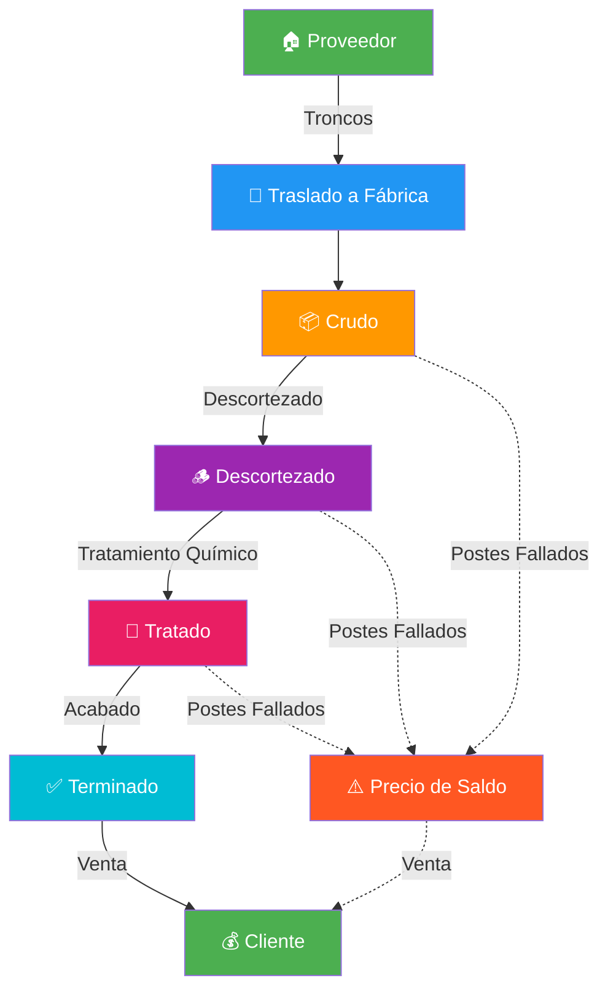

# 🪵 Postes Industriales ERP

### Sistema de Gestión Integral para la Industria de Postes de Madera Tratada

---

**Versión:** 1.0  
**Fecha:** Julio 2026  
**Plataforma:** Aplicación de Escritorio Multiplataforma

---

## Resumen Ejecutivo

**Postes Industriales ERP** es un sistema de gestión empresarial diseñado específicamente para la industria de fabricación y comercialización de postes de madera tratada. Este sistema digitaliza el proceso completo: desde la adquisición de troncos en predios forestales, pasando por las etapas de producción (descortezado, tratamiento químico, acabado), hasta la venta y entrega al cliente final.

> **El problema que resuelve:** Las empresas de postes de madera operan actualmente con hojas de cálculo, cuadernos y sistemas fragmentados. No tienen visibilidad en tiempo real del inventario por etapa de producción, los costos reales por poste son desconocidos, y el proceso de cotización y venta es lento y propenso a errores.

### Solución

Postes Industriales ERP ofrece una vista integral del negocio en una sola aplicación:

- **Inventario trazable** por etapa de producción (Crudo → Descortezado → Tratado → Terminado)
- **Costos reales** calculados automáticamente (materia prima + transporte + procesamiento)
- **Ventas con margen** calculado en tiempo real
- **Reportes PDF** generados con un clic
- **Dashboard operativo** con KPIs del negocio

---

## Funcionalidades Principales

| Módulo | Descripción | Estado |
|--------|-------------|--------|
| Panel (Dashboard) | Resumen operativo con KPIs, gráficos y actividad reciente | ✅ Completado |
| Catálogo | Gestión de tipos de postes y líneas de producto | ✅ Completado |
| Inventario por Etapa | Vista de inventario filtrada por etapa de producción con asistente de transformación | ✅ Completado |
| Insumos | Catálogo de materiales consumibles e inventario por lotes | ✅ Completado |
| Recetas | Plantillas de recursos por etapa (cantidad por poste) | ✅ Completado |
| Proveedores | Gestión de proveedores de materia prima | ✅ Completado |
| Traslados | Logística de transporte desde predios proveedores a fábrica | ✅ Completado |
| Clientes | Gestión de cuentas y contactos de clientes | ✅ Completado |
| Ventas | Registro de ventas con estimación de costos y márgenes | ✅ Completado |
| Contabilidad | Resumen financiero diario, mensual y anual | ✅ Completado |
| Historial | Auditoría completa de transformaciones y eventos | ✅ Completado |
| Reportes PDF | Generación de informes de inventario, ventas y producción | ✅ Completado |
| Manejo de Errores | Sistema centralizado de mensajes de error y recuperación | ✅ Completado |
| Localización Bolivia | Datos demo, moneda (Bs) y teléfonos (+591) bolivianos | ✅ Completado |

---

## Módulos Detallados

---

### Panel de Control (Dashboard)

**Objetivo:** Proporcionar una vista operativa completa del negocio en una sola pantalla.

**KPIs Principales:**
- Total de postes en sistema
- Postes disponibles para venta
- Valor estimado del inventario
- Costos de procesamiento acumulados
- Ventas registradas (mes actual)
- Margen promedio de ganancia

**Gráficos Incluidos:**
- Distribución de inventario por etapa de producción
- Costos mensuales de procesamiento
- Evolución de costos de producción

**Valor para el Negocio:** Los gerentes pueden tomar decisiones informadas en segundos, identificando cuellos de botella y oportunidades de mejora sin generar reportes manuales.

---

### Catálogo de Productos

**Objetivo:** Mantener un catálogo centralizado de todos los tipos de postes que la empresa fabrica y comercializa.

**Funcionalidades:**
- Crear, editar y eliminar tipos de postes
- Definir líneas de producto (Distribución Primaria, Secundaria, Transmisión, etc.)
- Descripciones detalladas para referencia

**Valor para el Negocio:** Estandarización de la información de productos, eliminando duplicados y inconsistencias en la definición de postes.

---

### Inventario por Etapa

**Objetivo:** Visualizar y gestionar el inventario completo organizado por etapa de producción.

**Etapas de Producción:**
1. **Crudo** — Troncos recién adquiridos, pendientes de procesamiento
2. **Descortezado** — Troncos despellejados y secados, listos para tratamiento
3. **Tratado** — Postes preservados en autoclave, pendientes de acabado
4. **Terminado** — Postes listos para entrega al cliente

**Funcionalidades:**
- Vista por pestañas de cada etapa
- Crear y editar lotes con costos detallados
- Asistente de transformación entre etapas
- Marcar postes fallados con precio de saldo
- Seguimiento de ubicación (Fábrica, En Proveedor, En Tránsito)

**Valor para el Negocio:** Visibilidad completa de dónde está cada poste en el proceso productivo. Identificación instantánea de inventario estancado y postes con defectos.

---

### Insumos y Materiales

**Objetivo:** Gestionar todos los materiales consumibles en el proceso de tratamiento de postes.

**Categorías de Insumos:**
- Materia prima (troncos)
- Preservantes (CCA, CCB, Creosota, ACQ)
- Agua industrial
- Energía y combustible para autoclave
- Preparación (parafina, pintura asfática, fungicida)
- Herrajes (placas, pernos, capuchones)
- Acabados (pintura protectora, barniz)
- Auxiliares (solvente, EPP, neutralizante)

**Funcionalidades:**
- Catálogo con costo por unidad de referencia
- Inventario por lotes con precio de adquisición
- Seguimiento de fechas de vencimiento
- Valor estimado total del inventario

**Valor para el Negocio:** Control preciso del consumo de materiales por etapa de producción, permitiendo optimizar compras y reducir desperdicios.

---

### Recetas por Etapa

**Objetivo:** Definir cuánto de cada insumo se consume por poste en cada etapa de producción.

**Funcionalidades:**
- Plantilla de receta por etapa de origen
- Cantidad por poste de cada recurso
- Notas y órdenes de visualización
- Sugerencia automática al crear transformaciones

**Valor para el Negocio:** Estandarización del proceso productivo. Cálculo automático de costos de procesamiento basado en recetas reales.

---

### Proveedores

**Objetivo:** Mantener un registro completo de los proveedores de materia prima.

**Funcionalidades:**
- Gestión de proveedores (nombre, contacto, notas)
- Registro de teléfono y datos de ubicación
- Búsqueda y filtrado rápido

**Valor para el Negocio:** Centralización de la información de proveedores, facilitando la gestión de relaciones comerciales y la comparación de precios.

---

### Traslados y Logística

**Objetivo:** Gestionar el transporte de troncos desde los predios de los proveedores hasta la fábrica.

**Funcionalidades:**
- Registro de traslados con chofer y vehículo
- Costos de flete y grúa por traslado
- Estados: En Progreso → Completado
- Asignación de lotes a cada traslado
- Distribución proporcional de costos entre lotes
- Seguimiento de llegada estimada

**Valor para el Negocio:** Control total de la logística de adquisición, con trazabilidad de costos de transporte por lote de postes.

---

### Clientes

**Objetivo:** Gestión centralizada de cuentas y contactos de clientes.

**Funcionalidades:**
- Crear, editar y eliminar clientes
- Información de contacto y notas
- Historial de compras asociado

**Valor para el Negocio:** Base de datos organizada de clientes para agilizar el proceso de venta y seguimiento comercial.

---

### Ventas y Facturación

**Objetivo:** Registrar ventas con estimación completa de costos y márgenes de ganancia.

**Funcionalidades:**
- Selección de cliente
- Selección de lotes y postes a vender
- Estimación de precio con margen configurable
- Desglose de costos: adquisición + transporte + procesamiento
- Precio sugerido por poste
- Historial de ventas con datos snapshot
- Eliminación de ventas registradas

**Flujo de Venta:**
1. Seleccionar cliente
2. Elegir postes del inventario
3. Definir cantidad y precio (o usar precio sugerido)
4. Revisar desglose de costos y margen
5. Confirmar venta

**Valor para el Negocio:** Cada venta se registra con toda la información de costos, permitiendo análisis de rentabilidad por producto, cliente o período.

---

### Contabilidad

**Objetivo:** Resumen financiero con vista diaria, mensual y anual de costos e ingresos.

**Funcionalidades:**
- Costos de procesamiento acumulados
- Costos de adquisición en inventario abierto
- Costos de transporte históricos y en stock
- Ventas registradas con desglose de adquisición y proceso
- Agregación por día, mes y año
- Exportación a PDF

**Valor para el Negocio:** Visión financiera clara para la toma de decisiones estratégicas, sin necesidad de contadores externos para reportes operativos.

---

### Historial y Auditoría

**Objetivo:** Registro completo y auditble de todas las transformaciones y eventos del sistema.

**Funcionalidades:**
- Lista cronológica de eventos
- Detalle de cada transformación (etapa origen → destino)
- Conteos de éxito y falla
- Duración del proceso
- Costos asociados
- Paginación para grandes volúmenes

**Valor para el Negocio:** Trazabilidad completa del proceso productivo, esencial para auditorías, garantías y mejora de procesos.

---

## Beneficios Empresariales

### 📊 Visibilidad en Tiempo Real

| Antes | Después |
|-------|---------|
| Inventario en hojas de cálculo | Dashboard con KPIs actualizados |
| Costos estimados a ojo | Costos calculados automáticamente |
| Reportes manuales semanales | Reportes PDF con un clic |

### 🏭 Control de Producción

| Antes | Después |
|-------|---------|
| Seguimiento en cuadernos | Vista por etapa con cantidades |
| Sin trazabilidad de fallas | Postes fallados registrados con precio de saldo |
| Recetas inconsistentes | Plantillas estandarizadas por etapa |

### 💰 Gestión de Costos

| Antes | Después |
|-------|---------|
| Costo real desconocido | Costo por poste calculado (material + transporte + proceso) |
| Márgenes a estimar | Margen real calculado por venta |
| Sin análisis de rentabilidad | Rentabilidad por cliente, producto y período |

### 🚚 Logística

| Antes | Después |
|-------|---------|
| Traslados sin registro | Cada traslado documentado con costos |
| Costos de transporte perdidos | Costos prorrateados por lote |

---

## Flujo de Producción

---

## Ventajas Competitivas

| Ventaja | Descripción |
|---------|-------------|
| **Aplicación de Escritorio** | Funciona sin conexión a internet. Los datos están seguros en la fábrica. |
| **Interfaz Moderna** | Diseño profesional con Compose Desktop, intuitivo y atractivo. |
| **Operación Rápida** | Base de datos SQLite local. Respuesta instantánea sin latencia de servidor. |
| **Flujo Simplificado** | Asistentes de transformación y venta guían al usuario paso a paso. |
| **Trazabilidad Completa** | Cada poste tiene historial de costos, transformaciones y ubicación. |
| **Costos en Tiempo Real** | Cálculo automático de costo por poste: material + transporte + proceso. |
| **Historial de Producción** | Registro auditble de cada transformación con conteos y duración. |
| **Reportes PDF** | Generación profesional de informes de inventario, ventas y producción. |
| **Arquitectura Modular** | Fácil de mantener, extender y personalizar. |
| **Localización Bolivia** | Moneda en Bolivianos (Bs), teléfonos +591, datos demo bolivianos. |

---

## Galería de Capturas

### Panel de Control

*KPIs operativos, gráficos de inventario y actividad reciente en una sola vista.*

### Inventario por Etapa

*Gestión de lotes por etapa de producción con asistente de transformación.*

### Insumos y Materiales

*Control de materiales consumibles con inventario por lotes.*

### Registro de Ventas

*Estimación de costos y márgenes en tiempo real por cada venta.*

### Traslados

*Logística de transporte con costos de flete y grúa.*

### Contabilidad

*Resumen financiero con aggregación diaria, mensual y anual.*

---

## Hoja de Ruta Futura

| Mejora | Descripción | Prioridad |
|--------|-------------|-----------|
| Validación de Entradas | Validación en tiempo real de todos los formularios | Alta |
| Códigos de Barras | Escaneo de lotes y productos | Media |
| Sincronización en la Nube | Backup y acceso remoto | Media |
| Gestión de Usuarios | Roles y permisos por usuario | Alta |
| Notificaciones | Alertas de stock bajo y vencimientos | Media |
| Análisis Avanzado | Reportes de tendencias y predicciones | Baja |
| Formato de Fechas | Adaptación a formato boliviano (dd/MM/yyyy) | Baja |
| Validación de Teléfonos | Formato +591 + 8 dígitos | Baja |

---

## Inversión

### Lo que Incluye

- Aplicación de escritorio completa (Windows, macOS, Linux)
- Base de datos SQLite embebida (sin servidor requerido)
- 11 módulos funcionales
- Sistema de reportes PDF
- Datos demo con precios reales de Bolivia
- Código fuente completo y documentado
- 209 pruebas automatizadas
- Arquitectura extensible para futuras mejoras

### Requisitos del Sistema

| Componente | Requisito |
|------------|-----------|
| Sistema Operativo | Windows 10+, macOS 12+, Linux (Ubuntu 20+) |
| RAM | 4 GB mínimo, 8 GB recomendado |
| Disco | 500 MB de espacio libre |
| Resolución | 1280 × 720 mínimo, 1920 × 1080 recomendado |
| Java | JDK 17+ (incluido en el instalador) |

---

## Conclusión

**Postes Industriales ERP** no es solo un software — es una herramienta estratégica que transforma la manera en que una empresa de postes de madera gestiona sus operaciones. Con visibilidad completa del inventario, costos calculados automáticamente, y reportes profesionales, la empresa puede:

- **Reducir costos operativos** eliminando trabajo manual y errores
- **Aumentar ventas** con cotizaciones más rápidas y precisas
- **Mejorar la productividad** con información accesible en tiempo real
- **Tomar mejores decisiones** basadas en datos reales, no estimaciones

> *"La digitalización no es un lujo — es una necesidad competitiva."*

---

**Contacto**

Para más información o una demostración personalizada, comuníquese con el equipo de desarrollo.

