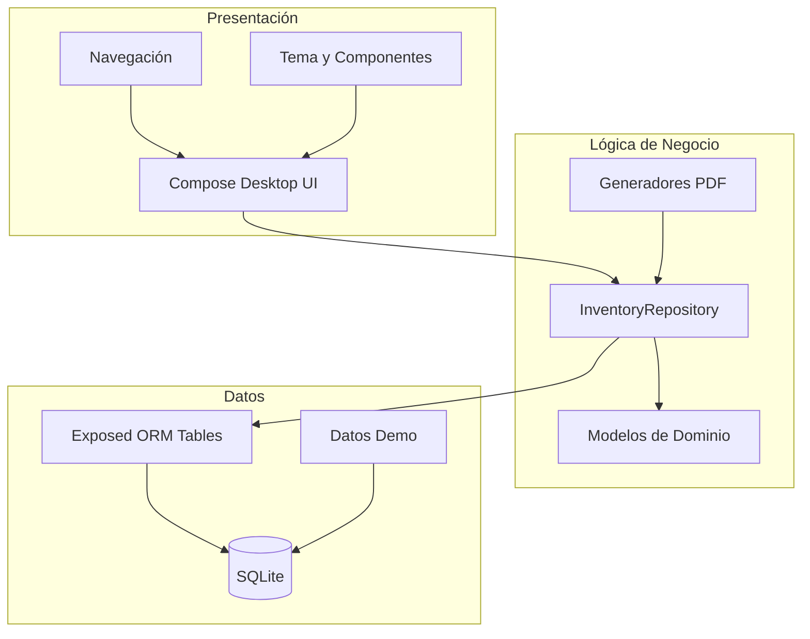
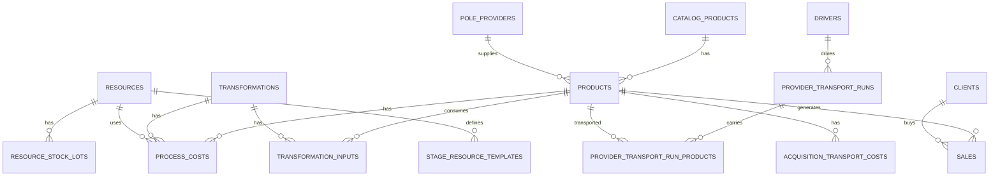
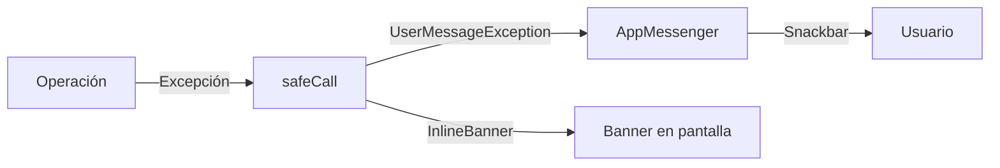

<div align="center">

# Postes Industriales ERP

## Visión Técnica

---

**Versión:** 1.0  
**Última Actualización:** Julio 2026

</div>

---

## Arquitectura General

El sistema sigue los principios de **Clean Architecture** y **MVVM** (Model-View-ViewModel), separando claramente la lógica de negocio, el acceso a datos y la presentación.



---

## Stack Tecnológico

| Componente | Tecnología | Versión | Propósito |
|------------|-----------|---------|-----------|
| **Lenguaje** | Kotlin | 2.0.21 | Lenguaje principal |
| **UI Framework** | Compose Desktop | 1.7.3 | Interfaz de usuario declarativa |
| **Base de Datos** | SQLite | 3.47.1 | Almacenamiento local |
| **ORM** | Exposed | 0.55.0 | Mapeo objeto-relacional |
| **Pool de Conexiones** | HikariCP | — | Gestión de conexiones DB |
| **Coroutines** | Kotlin Coroutines | 1.9.0 | Programación asíncrona |
| **PDF** | Apache PDFBox | 2.0.31 | Generación de reportes PDF |
| **Testing** | JUnit 5 + JUnit 4 | 5.10.2 | Pruebas unitarias y UI |
| **Testing UI** | Compose Testing | 1.7.3 | Pruebas de interfaz |
| **JVM** | OpenJDK | 17 | Plataforma de ejecución |

---

## Estructura del Proyecto

```
src/main/kotlin/com/inventory/industry/
├── Main.kt                          # Punto de entrada
├── capture/                         # Utilidades de captura
├── data/
│   ├── Tables.kt                    # 15 tablas Exposed ORM
│   ├── InventoryRepository.kt       # Repositorio central (2,232 líneas)
│   ├── Database.kt                  # Conexión y migración SQLite
│   └── Seed.kt                      # Datos demo iniciales
├── domain/
│   ├── ProductStage.kt              # Enum: CRUDO → DESCORTEZADO → TRATADO → TERMINADO
│   └── PoleStorageLocation.kt       # Enum: FABRICA, EN_PROVEEDOR, EN_TRANSITO
├── reports/
│   ├── PolesInventoryPdfGenerator.kt    # PDF de inventario
│   ├── SalesDetailPdfGenerator.kt       # PDF de ventas
│   ├── StagesDetailPdfGenerator.kt      # PDF por etapa
│   ├── PdfReportUtils.kt                # Utilidades compartidas
│   ├── PdfSaveDialog.kt                 # Diálogo de guardado
│   └── *.kt                             # Modelos de reporte
└── ui/
    ├── *Screen.kt                   # 11 pantallas principales
    ├── Format.kt                    # Formateo de moneda, cantidades, fechas
    ├── PdfExportHelper.kt           # Helper de exportación PDF
    ├── app/                         # AppMessenger, UserMessage, CompositionLocals
    ├── charts/                      # Componentes de gráficos
    ├── components/                   # 38 componentes reutilizables
    │   ├── buttons/                 # 4 variantes de botones
    │   ├── cards/                   # 4 tipos de tarjetas
    │   ├── dashboard/               # 13 componentes del dashboard
    │   ├── dialogs/                 # 4 diálogos reutilizables
    │   ├── feedback/                # 4 indicadores de estado
    │   ├── inputs/                  # 5 tipos de campos de entrada
    │   ├── sales/                   # 2 componentes de ventas
    │   └── table/                   # 2 componentes de tabla
    ├── layout/                      # AppShell, sidebar, command palette
    ├── models/                      # Modelos de UI
    ├── modifiers/                   # Modificadores Compose
    ├── navigation/                  # Rutas y estado de navegación
    ├── theme/                       # Tema visual, colores, tipografía
    └── utils/                       # Utilidades de UI
```

---

## Base de Datos

### Tablas (15 total)



| Tabla | Registros Demo | Propósito |
|-------|---------------|-----------|
| `catalog_products` | 5 | Catálogo maestro de tipos de postes |
| `pole_providers` | 4 | Proveedores de materia prima |
| `clients` | 5 | Clientes de la empresa |
| `products` | 9+ | Lotes de inventario en producción |
| `drivers` | 3 | Choferes de transporte |
| `provider_transport_runs` | 3 | Traslados de proveedores |
| `provider_transport_run_products` | 5 | Relación traslado-lotes |
| `acquisition_transport_costs` | 6 | Costos de transporte por lote |
| `resources` | 28 | Catálogo de insumos |
| `resource_stock_lots` | 150+ | Lotes de inventario de insumos |
| `stage_resource_templates` | 14 | Recetas por etapa |
| `transformations` | 5 | Eventos de transformación |
| `transformation_inputs` | 5 | Lotes consumidos por transformación |
| `process_costs` | 50+ | Costos de procesamiento |
| `sales` | 3 | Ventas registradas |

### Configuración de Base de Datos

- **Motor:** SQLite embebido (sin servidor)
- **Archivo:** `~/.inventory-industry/inventory.db`
- **Foreign Keys:** Habilitadas
- **Pool:** HikariCP con wrapper `NonClosingConnection`
- **Migración:** Automática via `SchemaUtils.createMissingTablesAndColumns`

---

## Repositorio Central

`InventoryRepository.kt` — **2,232 líneas**, **66 métodos públicos**

### Métodos por Dominio

| Dominio | Métodos | Funciones Principales |
|---------|---------|----------------------|
| Catálogo Productos | 3 | list, upsert, delete |
| Productos/Lotes | 9 | list, list-by-stage, get, list-sellable, upsert, delete, mark-failed, clear-failure |
| Proveedores | 3 | list, upsert, delete |
| Choferes | 3 | list, upsert, delete |
| Clientes | 3 | list, upsert, delete |
| Transporte | 5 | start, complete, cancel, list-runs, inbound-ETA |
| Costos Transporte | 3 | total-for-product, list-for-product, sync-costs |
| Ventas | 8 | list, load-all, list-in-range, record-sale, daily/monthly/yearly aggregation |
| Recursos | 3 | list, upsert, delete |
| Stock Recursos | 4 | list, upsert, delete, total-value-estimate |
| Recetas | 4 | list-templates, suggest-uses, upsert-template, delete-template |
| Transformaciones | 7 | create, start-process, complete-process, cancel-process, get, list-in-progress, list-all |
| Costos Proceso | 2 | list-for-product, list-for-transformation |
| Contabilidad | 8 | cost-overview, processing-cost-total, sale-cost-preview, count-by-stage, poles-by-stage, failed-count, failed-value, total-process-cost |
| Dashboard | 2 | inventory-flow-summary, recent-activity |

---

## Componentes de UI (38 archivos)

### Botones (4)

| Componente | Variante | Uso |
|-----------|----------|-----|
| `AppButton` | Primario | Acciones principales |
| `AppOutlinedButton` | Secundario | Acciones alternativas |
| `AppIconButton` | Icono | Acciones compactas |
| `AppFloatingActionButton` | FAB | Acciones flotantes |

### Tarjetas (4)

| Componente | Uso |
|-----------|-----|
| `AppCard` | Contenedor base |
| `SectionCard` | Secciones agrupadas |
| `MetricCard` | KPIs y métricas |
| `InfoCard` | Información detallada |

### Campos de Entrada (5)

| Componente | Uso |
|-----------|-----|
| `AppTextField` | Texto general |
| `AppTextArea` | Texto multilínea |
| `AppNumberField` | Valores numéricos |
| `AppDropdownField` | Selección desplegable |
| `AppSearchField` | Búsqueda |

### Feedback (4)

| Componente | Uso |
|-----------|-----|
| `LoadingIndicator` | Spinner de carga |
| `EmptyState` | Estado vacío |
| `StatusChip` | Indicador de estado |
| `SkeletonLoader` | Placeholder de carga |

### Dashboard (13)

| Componente | Uso |
|-----------|-----|
| `CompactKpiCard` | Tarjeta KPI compacta |
| `CompactStageProgressCard` | Progreso por etapa |
| `InventoryDonutCard` | Gráfico de dona |
| `RecentActivityCard` | Actividad reciente |
| `QuickActionsGrid` | Acciones rápidas |
| `QuickAnalyticsCard` | Análisis rápido |
| `WizardWorkflowCard` | Asistente de flujo |

### Tabla y Paginación (2)

| Componente | Uso |
|-----------|-----|
| `AppDataTable` | Tabla de datos genérica |
| `ListPaginationFooter` | Controles de paginación |

---

## Modelos de Dominio

### ProductStage (Enum de Producción)

```kotlin
enum class ProductStage {
    CRUDO,        // Tronco recién adquirido
    DESCORTEZADO, // Tronco despellejado y secado
    TRATADO,      // Poste preservado en autoclave
    TERMINADO     // Poste listo para entrega
}
```

### PoleStorageLocation (Enum de Ubicación)

```kotlin
enum class PoleStorageLocation {
    FABRICA,      // En la fábrica
    EN_PROVEEDOR, // En predio del proveedor
    EN_TRANSITO   // En tránsito a fábrica
}
```

---

## Patrones de Diseño

| Patrón | Implementación |
|--------|---------------|
| **MVVM** | State + Compose para presentación, Repository para lógica |
| **Repository** | `InventoryRepository` centraliza acceso a datos |
| **Composition Local** | `LocalAppMessenger`, `LocalSnackbarHostState` para dependencias globales |
| **Safe Call** | `safeCall()` para manejo de errores tipado |
| **Factory** | Seed functions para datos iniciales |
| **Observer** | StateFlow + Compose para reactividad |
| **Helper/Utility** | `exportPdfWorkflow()`, `formatMoneyBs()` |

---

## Estrategia de Pruebas

### Cobertura

| Tipo | Archivos | Pruebas | Herramienta |
|------|----------|---------|-------------|
| Unit Tests | 4 | 143 | JUnit 5 + SQLite in-memory |
| UI Tests | 2 | 38 | Compose Testing + JUnit 4 |
| Error Handling | 2 | 27 | JUnit 5 + Compose Testing |
| **Total** | **8** | **208** | |

### Infraestructura

- **Base de datos en memoria:** SQLite con wrapper `NonClosingConnection`
- **Builders reutilizables:** `TestDataBuilder` con métodos auto-transaccionales
- **Test base:** `UiTestBase` con `AppTheme` wrapper y CompositionLocals
- **Mocking:** No necesario — pruebas reales con base de datos

### Archivos de Prueba

| Archivo | Pruebas | Cubre |
|---------|---------|-------|
| `InventoryCrudTests.kt` | 41 | CRUD de entidades |
| `EdgeCaseTests.kt` | 47 | Casos borde y validación |
| `CostCalculationTests.kt` | 29 | Cálculos de costos |
| `DomainModelTests.kt` | 26 | Modelos de dominio |
| `ScreenTests.kt` | 24 | Renderizado de pantallas |
| `AppShellTest.kt` | 14 | Navegación |
| `UserMessageTest.kt` | 21 | Manejo de errores |
| `InlineBannerTest.kt` | 6 | Banner de errores |

---

## Generadores de Reportes PDF

| Generador | Contenido |
|-----------|-----------|
| `PolesInventoryPdfGenerator` | Resumen de inventario por etapa |
| `SalesDetailPdfGenerator` | Detalle de ventas por rango de fechas |
| `StagesDetailPdfGenerator` | Inventario detallado por etapa con costos |

### Funcionalidades PDF

- Encabezados profesionales con logo y fecha
- Tablas formateadas con bordes
- Totales y subtotales
- Selección de rango de fechas (Hoy, Semana, Mes, Año, Todo, Personalizado)
- Guardado vía diálogo del sistema

---

## Manejo de Errores

### Arquitectura



### Componentes

| Componente | Propósito |
|-----------|-----------|
| `ErrorCategory` | Categorías tipadas: Database, Validation, Network, PdfExport, Concurrency, Unknown |
| `UserMessage` | Mensaje de usuario con texto, recuperación y categoría |
| `safeCall()` | Wrapper que convierte excepciones a `Result<T>` |
| `UserMessageException` | Excepción tipada con `UserMessage` |
| `AppMessenger` | Sistema de mensajes global (Snackbar Short/Long) |
| `InlineBanner` | Banner inline con icono, texto de recuperación y dismiss |

---

## Localización

### Bolivia

| Elemento | Valor |
|----------|-------|
| Moneda | Bolivianos (Bs) |
| Formato | `formatMoneyBs()` → `Bs 1,250.00` |
| Teléfonos | +591 7x... (móvil), +591 4/3... (fijo) |
| Ciudades | Cochabamba, Santa Cruz, El Alto, Tarija |
| Patentes | Formato boliviano (BB-LPV-12) |

---

## Estadísticas del Proyecto

| Métrica | Cantidad |
|---------|----------|
| **Pantallas** | 11 |
| **Diálogos** | 21 (6 reutilizables + 15 inline) |
| **Tablas de BD** | 15 |
| **Métodos del Repositorio** | 66 |
| **Componentes de UI** | 38 |
| **Generadores PDF** | 3 |
| **Rutas de Navegación** | 11 |
| **Pruebas Automatizadas** | 208 |
| **Líneas de Código (repo)** | ~2,232 |
| **Archivos Kotlin** | ~80 |

---

## Mejoras Futuras

| Área | Mejora | Prioridad |
|------|--------|-----------|
| Validación | Validación en tiempo real de formularios | Alta |
| Seguridad | Gestión de usuarios y roles | Alta |
| UX | Códigos de barras y QR | Media |
| Cloud | Sincronización y backup remoto | Media |
| Notificaciones | Alertas de stock bajo y vencimientos | Media |
| Análisis | Reportes de tendencias y predicciones | Baja |
| i18n | Formato de fechas dd/MM/yyyy | Baja |
| Validación | Teléfonos formato +591 | Baja |

---

## Conclusiones Técnicas

**Postes Industriales ERP** demuestra una arquitectura sólida y extensible:

- **Clean Architecture** facilita mantenimiento y pruebas
- **MVVM + Compose** ofrece UI reactiva y moderna
- **SQLite embebido** elimina dependencia de servidores
- **208 pruebas** garantizan confiabilidad
- **38 componentes reutilizables** aceleran desarrollo futuro
- **Manejo de errores centralizado** mejora la experiencia de usuario

La arquitectura está preparada para escalar con nuevas funcionalidades sin requerir reescrituras significativas.
