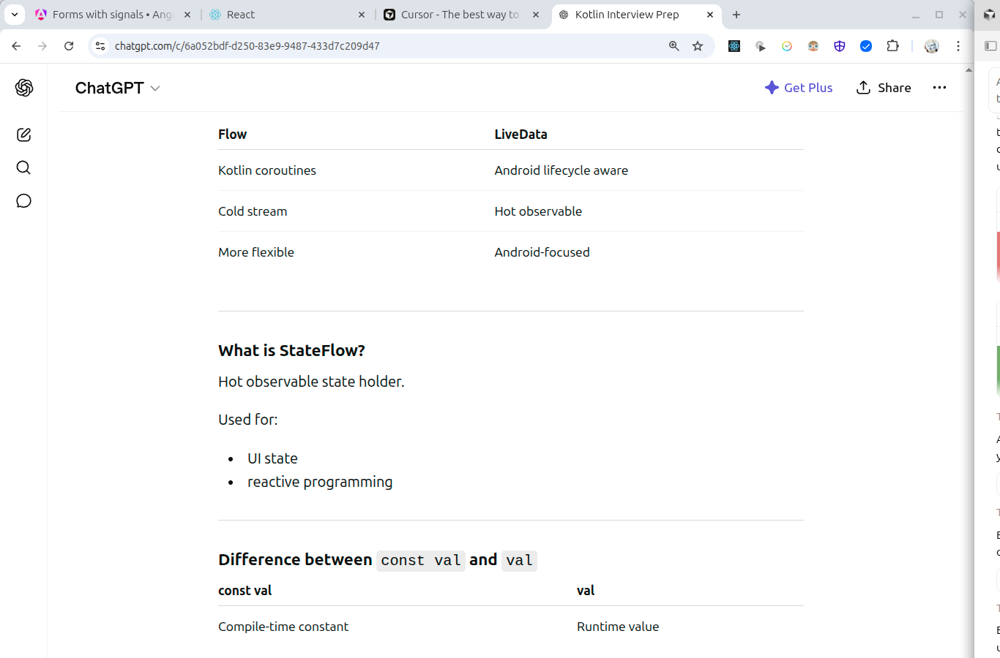

## Contabilidad

**Movimientos contables** — visión financiera agregada.

**Resumen de costos**
- Costos de procesamiento (histórico total, atribuido a stock abierto, imputado en ventas).
- Costos de adquisición en inventario y en ventas.
- Costos de transporte (histórico, stock abierto, vendido).

**Agregación de ventas**
- Por día, mes o año: importe total, postes vendidos, número de operaciones.
- Filtros por año y mes.

