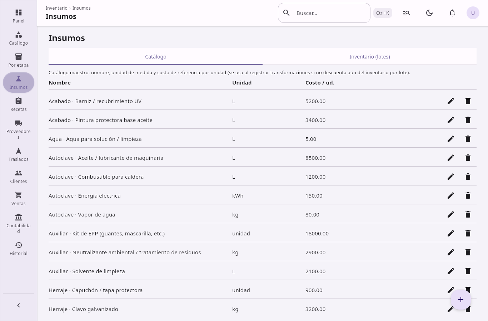

## Insumos

**Materiales e insumos** — dos pestañas:

**Catálogo de insumos**
- CRUD de materiales de procesamiento (nombre, unidad, costo por unidad).
- Más de 30 insumos precargados en la primera ejecución.

**Stock de insumos**
- CRUD de partidas de stock (cantidad, precio de adquisición, fecha de vencimiento, notas).
- Estimación del valor total del stock.

