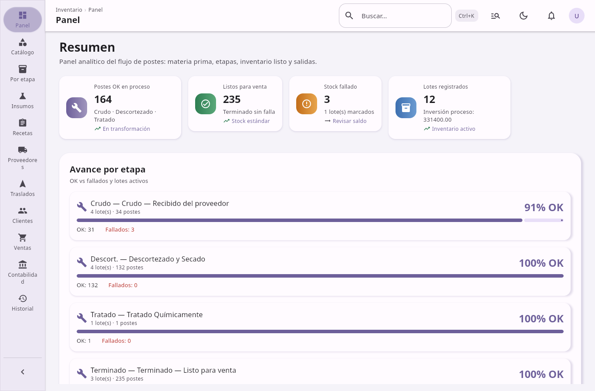

## Panel

**Resumen operativo** del negocio en un solo vistazo.

- Indicadores (KPIs): postes en proceso, listos para venta estándar, stock de salvamento fallado, total de lotes, costo acumulado de procesamiento.
- Desglose por etapa: cantidad total, lotes OK vs fallados.
- Gráficos: barras por etapa, dona de estado del inventario, línea de tendencia de ventas del mes.
- Actividad reciente: ventas, transformaciones, traslados y movimientos de inventario.
- Accesos rápidos a otras pantallas del sistema.

