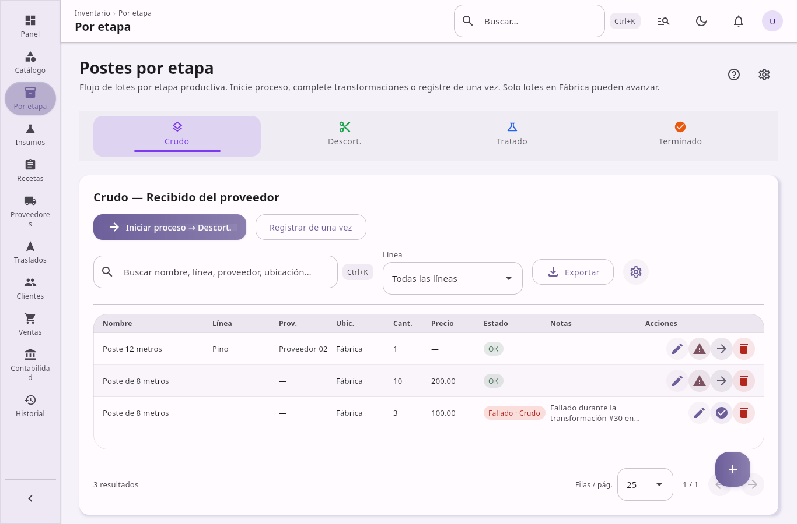

## Por etapa

**Inventario por etapa** — pantalla principal de operaciones diarias.

- Organizada en pestañas por etapa (Crudo, Descortezado, Tratado, Terminado).
- Crear, editar y eliminar lotes.
- Transformaciones: avance inmediato (un paso) o proceso WIP en dos pasos.
- Sugerencia automática de consumo de insumos según recetas configuradas.
- Marcar lotes como fallados o revertir el estado de fallo.
- Búsqueda, filtro por línea de producto y paginación.
- Exportar inventario filtrado a CSV.

