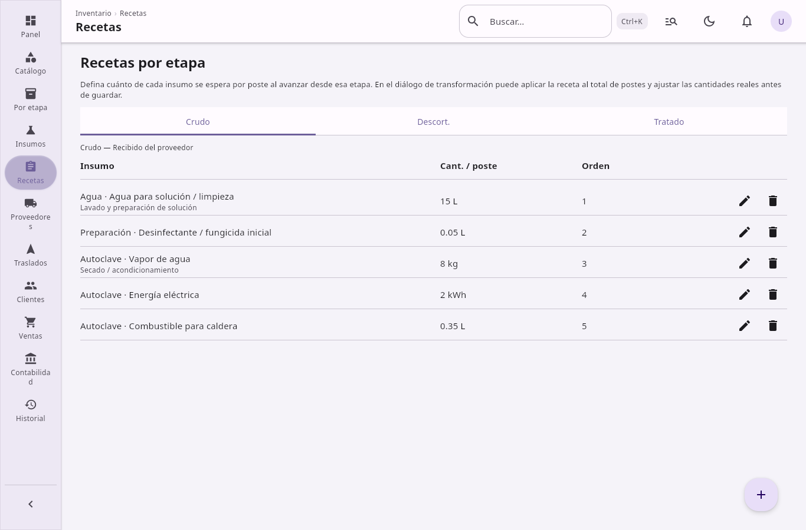

## Recetas

**Recetas por etapa** — plantillas de consumo de insumos.

- Definir, por etapa de origen (Crudo, Descortezado, Tratado), cuánto de cada insumo se consume por poste.
- Orden de visualización y notas por línea de receta.
- Al ejecutar una transformación, el sistema sugiere las cantidades de insumos según la receta activa.

