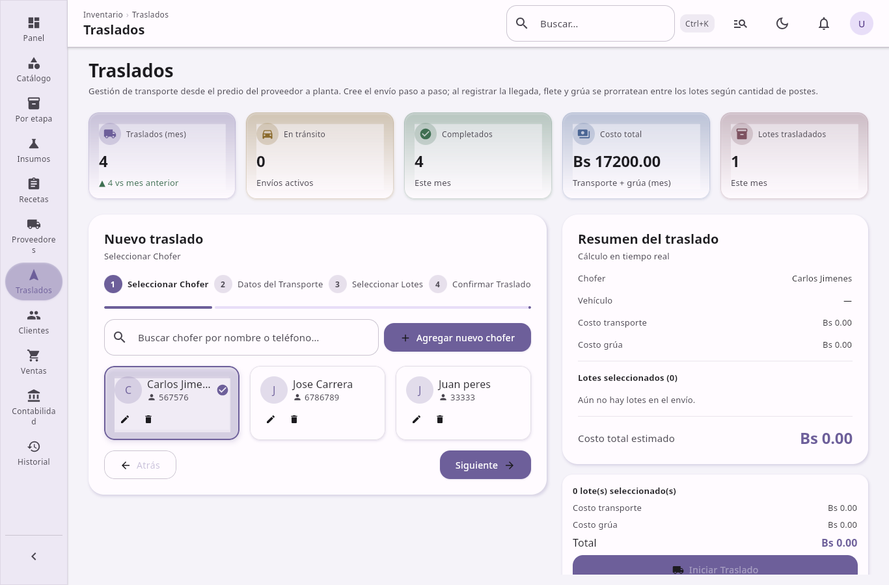

## Traslados

**Traslados entre ubicaciones** — transporte desde el proveedor a la fábrica.

**Conductores**
- CRUD de conductores (nombre, teléfono, notas).

**Corridas de transporte**
- Iniciar traslado: seleccionar lotes en predio del proveedor, asignar conductor y vehículo, registrar costo de flete y grúa, fechas de salida y llegada esperada.
- Los lotes pasan a ubicación En tránsito.
- Completar llegada: prorrateo automático de flete y grúa entre los lotes; los lotes pasan a Fábrica.
- Cancelar traslado en curso: los lotes vuelven a Proveedor.
- Historial de corridas con estados: en curso, completada, cancelada.

