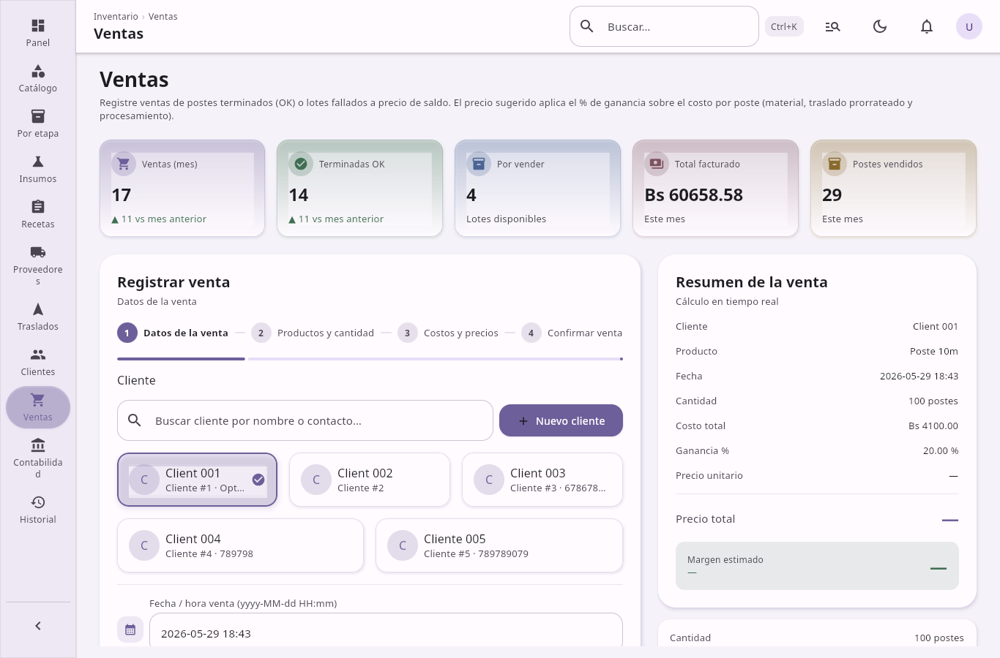

## Ventas

**Pedidos y facturación** — registro comercial de salida de stock.

- Venta de postes terminados OK o de lotes fallados (salvamento).
- Selección de cliente y lote con validación de cantidad disponible.
- Vista previa de costos antes de confirmar: costo de materia prima, transporte prorrateado, costo puesto en planta, costo de procesamiento acumulado, precio unitario sugerido con margen configurable.
- Registro de venta con fecha, notas e importe total.
- Snapshot contable por venta conservado aunque el lote se elimine después.

